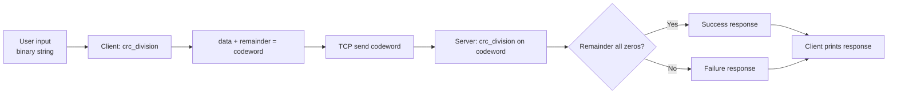
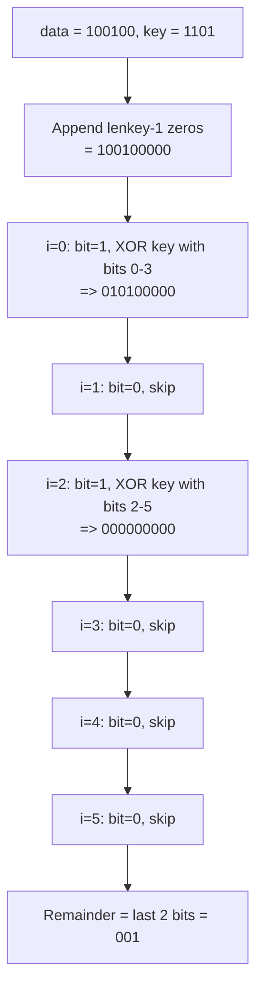
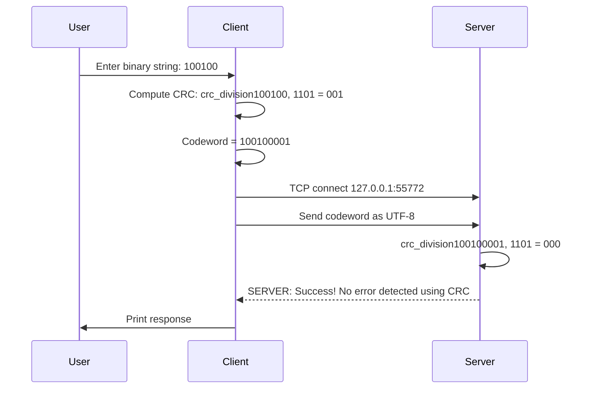

**User:**

<user_message>
use 'plans/crc-build-prompt.md' and build the TCP socket CRC error detection system
</user_message>
[read_file for 'plans/crc-build-prompt.md']
File: plans/crc-build-prompt.md
  1 | # Prompt: Build a CRC Error Detection System from Scratch (with Tests)
  2 | 
  3 | ```
  4 | You are a software engineer building a CRC-based error detection system over TCP.
  5 | I need you to implement the full system from scratch — including the CRC algorithm,
  6 | a TCP client, a TCP server, and a comprehensive test suite — based ONLY on the
  7 | specifications below. Do not reference or copy any existing code; build everything
  8 | from these requirements.
  9 | 
 10 | ---
 11 | 
 12 | ## Specification
 13 | 
 14 | ### 1. CRC Algorithm (library module)
 15 | 
 16 | The project must include a reusable CRC library module with the following:
 17 | 
 18 | #### 1.1 Constants
 19 | - A divisor (polynomial key) of `1101` (binary). This is a 3-bit CRC polynomial.
 20 | 
 21 | #### 1.2 `xor(dividend: str, divisor: str) -> str`
 22 | - Accept two binary strings of equal length.
 23 | - Perform a bitwise XOR operation.
 24 | - Return the result as a binary string.
 25 | - Example: `xor("1100", "1010")` → `"0110"`.
 26 | 
 27 | #### 1.3 `crc_division(data: str, key: str) -> str`
 28 | - Accept a binary string `data` and a binary string `key` (the polynomial divisor).
 29 | - Implement binary polynomial division (modulo-2 division, i.e., XOR-based):
 30 |   1. Append `len(key) - 1` zeros to the data (this is the dividend).
 31 |   2. Walk through the dividend bit by bit from left to right.
 32 |   3. Whenever the current bit is `1`, XOR the next `len(key)` bits with the key.
 33 |   4. After processing all original data bits, the last `len(key) - 1` bits of the
 34 |      working value are the CRC remainder.
 35 | - Return the remainder as a binary string of length `len(key) - 1`.
 36 | - Example: `crc_division("100100", "1101")` → `"001"`.
 37 | 
 38 | #### 1.4 Codeword property
 39 | - A **codeword** is formed as `data + remainder`.
 40 | - If you pass a valid codeword back through `crc_division()` with the same key,
 41 |   the remainder MUST be all zeros (i.e., `"00"` for a 3-bit CRC).
 42 |   This is the fundamental invariant of CRC error detection.
 43 | 
 44 | ### 2. Network Configuration (separate module)
 45 | 
 46 | - Define a default server port constant: `55772`.
 47 | - This module should be importable by both client and server.
 48 | 
 49 | ### 3. TCP Server
 50 | 
 51 | The server must:
 52 | - Create a TCP socket bound to `127.0.0.1` on the default port.
 53 | - Listen for incoming connections (backlog of 5).
 54 | - Accept a connection, then:
 55 |   - Receive up to 1024 bytes from the client, decoded as a UTF-8 string.
 56 |   - Treat the received string as a binary codeword (data + CRC).
 57 |   - Run `crc_division()` on the codeword using the divisor `1101`.
 58 |   - If the remainder is all zeros → send back the message
 59 |     `"SERVER: Success! No error detected using CRC"`
 60 |   - If the remainder is non-zero → send back the message
 61 |     `"SERVER: Failure! Error detected using CRC"`
 62 |   - Close the client connection.
 63 | - Continue accepting new connections until interrupted (Ctrl+C).
 64 | - Handle `KeyboardInterrupt` gracefully by shutting down the server socket.
 65 | - Print status messages to stdout (connection info, errors detected, etc.).
 66 | 
 67 | ### 4. TCP Client
 68 | 
 69 | The client must:
 70 | - Prompt the user to enter a binary string (e.g., `"100100"`).
 71 | - Compute the CRC remainder of that data using `crc_division()` and the divisor `1101`.
 72 | - Form the codeword as `data + remainder`.
 73 | - Print the codeword to stdout.
 74 | - Create a TCP socket and connect to `127.0.0.1` on the default port.
 75 | - Send the codeword as a UTF-8 encoded string.
 76 | - Receive the server's response (up to 1024 bytes) and print it.
 77 | - Close the connection.
 78 | 
 79 | ### 5. Testing
 80 | 
 81 | Write tests using **pytest**. Do NOT depend on any external test utilities beyond
 82 | pytest and the Python standard library. Tests go in a `tests/` directory.
 83 | 
 84 | #### 5.1 Unit Tests (no network required)
 85 | 
 86 | Test `xor()`:
 87 | - Standard case: `xor("1100", "1010")` → `"0110"`
 88 | - All bits set: `xor("111", "111")` → `"000"`
 89 | - No bits set: `xor("000", "111")` → `"111"`
 90 | - Single bit: `xor("1", "1")` → `"0"`
 91 | - Mismatched length (if not validated, document the behaviour)
 92 | 
 93 | Test `crc_division()`:
 94 | - Known case: `crc_division("100100", "1101")` → `"001"`
 95 | - Verify the remainder length is always `len(key) - 1`
 96 | - **Codeword validity property**: For any random data string, compute
 97 |   `remainder = crc_division(data, key)`, then verify
 98 |   `crc_division(data + remainder, key)` produces all zeros.
 99 | - Edge cases: empty string, single-bit data, data shorter than key.
100 | 
101 | #### 5.2 End-to-End Tests (network required; run against a real server)
102 | 
103 | Use pytest fixtures to manage the server lifecycle:
104 | - Start the server in a background thread listening on `127.0.0.1`.
105 | - Use **a random available port** (port 0) — do NOT hardcode port 55772.
106 | - Gracefully shut down the server after each test (fixture teardown).
107 | 
108 | Tests:
109 | - **Valid codeword**: Send a correctly computed codeword. Assert the response
110 |   contains `"Success! No error detected using CRC"`.
111 | - **Corrupted codeword**: Send a valid codeword, then flip one bit, and send it.
112 |   Assert the response contains `"Failure! Error detected using CRC"`.
113 | - **Multiple connections**: Send valid codewords across 3 sequential connections
114 |   to the same server instance. All 3 should succeed.
115 | - **Empty/malformed data**: Send an empty string or a non-binary string.
116 |   Document and test the server's behaviour.
117 | 
118 | ### 6. Project Structure
119 | 
120 | ```
121 | <project-root>/
122 | ├── lib/
123 | │   ├── __init__.py
124 | │   ├── crc.py          # CRC algorithm (xor, crc_division, DIVISOR)
125 | │   └── network.py      # SERVER_PORT constant
126 | ├── client.py            # TCP client
127 | ├── server.py            # TCP server
128 | ├── tests/
129 | │   ├── __init__.py
130 | │   ├── test_crc.py      # Unit tests for CRC functions
131 | │   └── test_integration.py  # End-to-end client-server tests
132 | ├── requirements.txt     # pytest only
133 | └── README.md            # Explain the system, the CRC algorithm, how to run
134 | ```
135 | 
136 | ### 7. Constraints
137 | 
138 | - Python 3.10+.
139 | - Single `pytest` command runs all tests.
140 | - The server must use `threading` for the test fixture (not `subprocess`).
141 | - The E2E tests must NOT hardcode port 55772 — bind to port 0 and retrieve
142 |   the actual port from the socket.
143 | - All binary strings are plain Python `str` objects containing only `'0'` and `'1'`.
144 | - Include clear docstrings and type hints on all public functions.
145 | ```
146 | 
<environment_details>
# VSCode Visible Files
plans/crc-build-prompt.md

# VSCode Open Tabs
plans/crc-build-prompt.md

# Current Time
Current time in ISO 8601 UTC format: 2026-06-04T03:25:16.229Z
User time zone: Australia/Sydney, UTC+10:00

# Current Cost
$0.00

# Current Mode
<slug>architect</slug>
<name>🏗️ Architect</name>
<model>deepseek-reasoner</model>


# Current Workspace Directory (/home/rmitaiil/Documents/dcncc/as3) Files
CRC.zip
__MACOSX/
__MACOSX/._CRC
__MACOSX/CRC/
__MACOSX/CRC/._.DS_Store
__MACOSX/CRC/lib/
__MACOSX/CRC/lib/._.DS_Store
llm_usage/
llm_usage/zoo_task_deepseek-reasoner_jun-4-2026_1-22-00-pm.md
plans/
plans/crc-build-prompt.md
You have not created a todo list yet. Create one with `update_todo_list` if your task is complicated or involves multiple steps.
</environment_details>

---

**Assistant:**

[Reasoning]
The user wants me to build a CRC error detection system based on the spec in `plans/crc-build-prompt.md`. Let me first check the skill applicability - none of the skills seem to match this task (it's a Python networking/CRC project, not covered by any skill). So I'll proceed normally.

Let me first gather more context about what's already in the workspace. There's a CRC.zip file and some __MACOSX artifacts. Let me check if there's already anything extracted or built.

Let me start by exploring the workspace and understanding the full context, then create a detailed plan.
Let me start by gathering more context about the existing workspace state.
[Tool Use: list_files]
Path: /home/rmitaiil/Documents/dcncc/as3
Recursive: true

---

**User:**

[Tool]
CRC.zip
__MACOSX/
__MACOSX/._CRC
__MACOSX/CRC/
__MACOSX/CRC/._.DS_Store
__MACOSX/CRC/lib/
__MACOSX/CRC/lib/._.DS_Store
llm_usage/
llm_usage/zoo_task_deepseek-reasoner_jun-4-2026_1-22-00-pm.md
plans/
plans/crc-build-prompt.md
<environment_details>
# VSCode Visible Files
plans/crc-build-prompt.md

# VSCode Open Tabs
plans/crc-build-prompt.md

# Current Time
Current time in ISO 8601 UTC format: 2026-06-04T03:25:19.596Z
User time zone: Australia/Sydney, UTC+10:00

# Current Cost
$0.00

# Current Mode
<slug>architect</slug>
<name>🏗️ Architect</name>
<model>deepseek-reasoner</model>
You have not created a todo list yet. Create one with `update_todo_list` if your task is complicated or involves multiple steps.
</environment_details>

---

**Assistant:**

[Reasoning]
Let me look at the CRC.zip to see if there's existing code, and also check if there's a `.venv` directory.
[Tool Use: list_files]
Path: /home/rmitaiil/Documents/dcncc/as3
Recursive: false

---

**User:**

[Tool]
CRC.zip
__MACOSX/
llm_usage/
plans/
<environment_details>
# VSCode Visible Files
plans/crc-build-prompt.md

# VSCode Open Tabs
plans/crc-build-prompt.md

# Current Time
Current time in ISO 8601 UTC format: 2026-06-04T03:25:21.433Z
User time zone: Australia/Sydney, UTC+10:00

# Current Cost
$0.00

# Current Mode
<slug>architect</slug>
<name>🏗️ Architect</name>
<model>deepseek-reasoner</model>
You have not created a todo list yet. Create one with `update_todo_list` if your task is complicated or involves multiple steps.
</environment_details>

---

**Assistant:**

[Reasoning]
Let me check if there's a .venv already, and check what Python version is available.
[Tool Use: execute_command]
Command: python3 --version

---

**User:**

[Tool (Error)]
{"status":"error","message":"The tool execution failed","error":"Tool \"execute_command\" is not allowed in architect mode."}
<environment_details>
# VSCode Visible Files
plans/crc-build-prompt.md

# VSCode Open Tabs
plans/crc-build-prompt.md

# Current Time
Current time in ISO 8601 UTC format: 2026-06-04T03:25:23.221Z
User time zone: Australia/Sydney, UTC+10:00

# Current Cost
$0.00

# Current Mode
<slug>architect</slug>
<name>🏗️ Architect</name>
<model>deepseek-reasoner</model>
You have not created a todo list yet. Create one with `update_todo_list` if your task is complicated or involves multiple steps.
</environment_details>

---

**Assistant:**

[Reasoning]
OK, architect mode can't execute commands. Let me check if there's a .venv by listing files including hidden ones, and also check the CRC.zip to understand what's in it.
[Tool Use: list_files]
Path: /home/rmitaiil/Documents/dcncc/as3
Recursive: true

---

**User:**

[Tool]
CRC.zip
__MACOSX/
__MACOSX/._CRC
__MACOSX/CRC/
__MACOSX/CRC/._.DS_Store
__MACOSX/CRC/lib/
__MACOSX/CRC/lib/._.DS_Store
llm_usage/
llm_usage/zoo_task_deepseek-reasoner_jun-4-2026_1-22-00-pm.md
plans/
plans/crc-build-prompt.md
<environment_details>
# VSCode Visible Files
plans/crc-build-prompt.md

# VSCode Open Tabs
plans/crc-build-prompt.md

# Current Time
Current time in ISO 8601 UTC format: 2026-06-04T03:25:24.830Z
User time zone: Australia/Sydney, UTC+10:00

# Current Cost
$0.00

# Current Mode
<slug>architect</slug>
<name>🏗️ Architect</name>
<model>deepseek-reasoner</model>
You have not created a todo list yet. Create one with `update_todo_list` if your task is complicated or involves multiple steps.
</environment_details>

---

**Assistant:**

[Reasoning]
It seems like there's a CRC.zip but it's not extracted (only __MACOSX metadata files exist). The user wants me to build the system following the prompt in `plans/crc-build-prompt.md`. Let me check if there's a .venv directory (hidden).
[Tool Use: list_files]
Path: /home/rmitaiil/Documents/dcncc/as3
Recursive: false

---

**User:**

[Tool]
CRC.zip
__MACOSX/
llm_usage/
plans/
<environment_details>
# VSCode Visible Files
plans/crc-build-prompt.md

# VSCode Open Tabs
plans/crc-build-prompt.md

# Current Time
Current time in ISO 8601 UTC format: 2026-06-04T03:25:26.999Z
User time zone: Australia/Sydney, UTC+10:00

# Current Cost
$0.00

# Current Mode
<slug>architect</slug>
<name>🏗️ Architect</name>
<model>deepseek-reasoner</model>
You have not created a todo list yet. Create one with `update_todo_list` if your task is complicated or involves multiple steps.
</environment_details>

---

**Assistant:**

[Reasoning]
No `.venv` visible. Let me check if hidden files exist using a different approach - I can try to see if the CRC.zip is meant to be extracted or if the project is meant to be built from scratch. Let me look at the plans directory for any other files that might have context.

Actually, let me also check the llm_usage log to see what was done before.
[Tool Use: read_file]
Path: /home/rmitaiil/Documents/dcncc/as3/llm_usage/zoo_task_deepseek-reasoner_jun-4-2026_1-22-00-pm.md

---

**User:**

[Tool]
File: /home/rmitaiil/Documents/dcncc/as3/llm_usage/zoo_task_deepseek-reasoner_jun-4-2026_1-22-00-pm.md
   1 | **User:**
   2 | 
   3 | <user_message>
   4 | help me design a prompt to reverse engineer this socket CRC implementation complete with unit and end to tests. You are design the prompt not the implementation directly
   5 | </user_message>
   6 | <environment_details>
   7 | # VSCode Visible Files
   8 | 
   9 | 
  10 | # VSCode Open Tabs
  11 | 
  12 | 
  13 | # Current Time
  14 | Current time in ISO 8601 UTC format: 2026-06-04T03:18:58.995Z
  15 | User time zone: Australia/Sydney, UTC+10:00
  16 | 
  17 | # Current Cost
  18 | $0.00
  19 | 
  20 | # Current Mode
  21 | <slug>ask</slug>
  22 | <name>❓ Ask</name>
  23 | <model>deepseek-reasoner</model>
  24 | 
  25 | 
  26 | # Current Workspace Directory (/home/rmitaiil/Documents/dcncc/as3) Files
  27 | CRC.zip
  28 | __MACOSX/
  29 | __MACOSX/._CRC
  30 | __MACOSX/CRC/
  31 | __MACOSX/CRC/._.DS_Store
  32 | __MACOSX/CRC/lib/
  33 | __MACOSX/CRC/lib/._.DS_Store
  34 | CRC/
  35 | CRC/.DS_Store
  36 | CRC/client.py
  37 | CRC/server.py
  38 | CRC/lib/
  39 | CRC/lib/.DS_Store
  40 | CRC/lib/crc.py
  41 | CRC/lib/network.py
  42 | You have not created a todo list yet. Create one with `update_todo_list` if your task is complicated or involves multiple steps.
  43 | </environment_details>
  44 | 
  45 | ---
  46 | 
  47 | **Assistant:**
  48 | 
  49 | [Reasoning]
  50 | The user wants me to help design a prompt to reverse engineer a socket CRC implementation complete with unit and end-to-end tests. They have a CRC.zip file that's been extracted with several files. Let me first explore the codebase to understand the existing implementation, then design a comprehensive prompt.
  51 | 
  52 | Let me look at the files in the CRC directory.
  53 | [Tool Use: update_todo_list]
  54 | Todos: [x] Explore the CRC codebase to understand the existing implementation
  55 | [ ] Design a comprehensive prompt for reverse engineering the socket CRC implementation
  56 | [ ] Present the prompt to the user
  57 | 
  58 | ---
  59 | 
  60 | **User:**
  61 | 
  62 | [Tool]
  63 | Todo list updated successfully.
  64 | <environment_details>
  65 | # VSCode Visible Files
  66 | 
  67 | 
  68 | # VSCode Open Tabs
  69 | 
  70 | 
  71 | # Current Time
  72 | Current time in ISO 8601 UTC format: 2026-06-04T03:19:02.324Z
  73 | User time zone: Australia/Sydney, UTC+10:00
  74 | 
  75 | # Current Cost
  76 | $0.00
  77 | 
  78 | # Current Mode
  79 | <slug>ask</slug>
  80 | <name>❓ Ask</name>
  81 | <model>deepseek-reasoner</model>
  82 | ====
  83 | 
  84 | REMINDERS
  85 | 
  86 | Below is your current list of reminders for this task. Keep them updated as you progress.
  87 | 
  88 | | # | Content | Status |
  89 | |---|---------|--------|
  90 | | 1 | Explore the CRC codebase to understand the existing implementation | Completed |
  91 | | 2 | Design a comprehensive prompt for reverse engineering the socket CRC implementation | Pending |
  92 | | 3 | Present the prompt to the user | Pending |
  93 | 
  94 | 
  95 | IMPORTANT: When task status changes, remember to call the `update_todo_list` tool to update your progress.
  96 | 
  97 | </environment_details>
  98 | 
  99 | ---
 100 | 
 101 | **Assistant:**
 102 | 
 103 | [Reasoning]
 104 | Let me read all the source files to understand the implementation.
 105 | Let me explore the existing code to understand the CRC implementation before designing the prompt.
 106 | [Tool Use: read_file]
 107 | Path: CRC/client.py
 108 | [Tool Use: read_file]
 109 | Path: CRC/server.py
 110 | [Tool Use: read_file]
 111 | Path: CRC/lib/crc.py
 112 | [Tool Use: read_file]
 113 | Path: CRC/lib/network.py
 114 | 
 115 | ---
 116 | 
 117 | **User:**
 118 | 
 119 | [Tool]
 120 | File: CRC/client.py
 121 |  1 | from lib.crc import *
 122 |  2 | from lib.network import *
 123 |  3 | import socket
 124 |  4 | 
 125 |  5 | # Get a binary string from user
 126 |  6 | data = input("Enter a binary string (example: 100100): ")
 127 |  7 | 
 128 |  8 | # Generate CRC and send data
 129 |  9 | crc = crc_division(data, DIVISOR)
 130 | 10 | codeword = data + crc  # Append CRC to original data
 131 | 11 | print(f"Send to server (data + CRC): {codeword}")
 132 | 12 | 
 133 | 13 | # # Create a socket object
 134 | 14 | client_socket = socket.socket(socket.AF_INET, socket.SOCK_STREAM)
 135 | 15 | 
 136 | 16 | # # Connect to the server
 137 | 17 | client_socket.connect(("127.0.0.1", SERVER_PORT))
 138 | 18 | 
 139 | 19 | # # Send a message
 140 | 20 | client_socket.send(codeword.encode())
 141 | 21 | 
 142 | 22 | # # Receive a response
 143 | 23 | response = client_socket.recv(1024).decode()
 144 | 24 | print(response)
 145 | 25 | 
 146 | 26 | # # Close the connection
 147 | 27 | client_socket.close()
 148 | 28 | 
 149 | [Tool]
 150 | File: CRC/server.py
 151 |  1 | from lib.crc import *
 152 |  2 | from lib.network import SERVER_PORT
 153 |  3 | import socket
 154 |  4 | 
 155 |  5 | # Create a TCP socket
 156 |  6 | server_socket = socket.socket(socket.AF_INET, socket.SOCK_STREAM)
 157 |  7 | 
 158 |  8 | # Bind the socket to localhost and a specified port
 159 |  9 | # SERVER_PORT is a constant defined in the network.py in the lib folder
 160 | 10 | server_socket.bind(("127.0.0.1", SERVER_PORT))
 161 | 11 | 
 162 | 12 | # Listen for incoming connections (max queue size: 5)
 163 | 13 | server_socket.listen(5)
 164 | 14 | 
 165 | 15 | print(f"Server is listening on port {SERVER_PORT}...")
 166 | 16 | 
 167 | 17 | try:
 168 | 18 |     while True:
 169 | 19 |         # Accept a client connection
 170 | 20 |         client_socket, client_address = server_socket.accept()
 171 | 21 | 
 172 | 22 |         # Print the client's address
 173 | 23 |         print(f"Connection established with {client_address}")
 174 | 24 | 
 175 | 25 |         # Receive data from the client (max 1024 bytes) and decode it
 176 | 26 |         data = client_socket.recv(1024).decode()
 177 | 27 | 
 178 | 28 |         # Print the received data
 179 | 29 |         print(f"Received from client: {data}")
 180 | 30 | 
 181 | 31 |         print("Error checking using CRC...")
 182 | 32 |         # Perform CRC error detection on the received data
 183 | 33 |         remainder = crc_division(data, DIVISOR)
 184 | 34 | 
 185 | 35 |         # If remainder is all zeros, no error
 186 | 36 |         if remainder == '0' * (len(DIVISOR) - 1):
 187 | 37 |             message = "Success! No error detected using CRC"
 188 | 38 | 
 189 | 39 |             # show on the server side
 190 | 40 |             print(message)
 191 | 41 | 
 192 | 42 |             # show on the client side
 193 | 43 |             client_socket.send(f"SERVER: {message}".encode())
 194 | 44 |         else:
 195 | 45 |             message = "Failure! Error detected using CRC"
 196 | 46 | 
 197 | 47 |             # show on the server side
 198 | 48 |             print(message)
 199 | 49 | 
 200 | 50 |             # show on the client side
 201 | 51 |             client_socket.send(f"SERVER: {message}".encode())
 202 | 52 | 
 203 | 53 |         client_socket.close()
 204 | 54 | except KeyboardInterrupt:
 205 | 55 |     print("\nServer shutting down...")
 206 | 56 |     server_socket.close()
 207 | 57 | 
 208 | [Tool]
 209 | File: CRC/lib/crc.py
 210 |  1 | 
 211 |  2 | # set a divisor value here to be used
 212 |  3 | # by both client and server
 213 |  4 | DIVISOR = "1101"
 214 |  5 | 
 215 |  6 | 
 216 |  7 | def xor(dividend, divisor):
 217 |  8 |     # Perform XOR operation on the dividend and divisor
 218 |  9 |     result = ['0'] * len(dividend)
 219 | 10 |     for i in range(len(divisor)):
 220 | 11 |         result[i] = str(int(dividend[i]) ^ int(divisor[i]))
 221 | 12 |     return ''.join(result)
 222 | 13 | 
 223 | 14 | 
 224 | 15 | def crc_division(data, key):
 225 | 16 |     # Append zeros to the data based on the key length
 226 | 17 |     n = len(key) - 1
 227 | 18 |     # Convert string to list for mutability
 228 | 19 |     appended_data = list(data + '0' * n)
 229 | 20 |     divisor = key
 230 | 21 | 
 231 | 22 |     # Perform polynomial division
 232 | 23 |     for i in range(len(data)):
 233 | 24 |         if appended_data[i] == '1':
 234 | 25 |             xor_result = xor(''.join(appended_data[i:i+len(divisor)]), divisor)
 235 | 26 |             # Modify list directly
 236 | 27 |             appended_data[i:i+len(divisor)] = list(xor_result)
 237 | 28 | 
 238 | 29 |     # Convert list back to string and return remainder
 239 | 30 |     return ''.join(appended_data[-n:])
 240 | 31 | 
 241 | [Tool]
 242 | File: CRC/lib/network.py
 243 | 1 | SERVER_PORT = 55772
 244 | 2 | 
 245 | <environment_details>
 246 | # VSCode Visible Files
 247 | 
 248 | 
 249 | # VSCode Open Tabs
 250 | 
 251 | 
 252 | # Current Time
 253 | Current time in ISO 8601 UTC format: 2026-06-04T03:19:04.711Z
 254 | User time zone: Australia/Sydney, UTC+10:00
 255 | 
 256 | # Current Cost
 257 | $0.00
 258 | 
 259 | # Current Mode
 260 | <slug>ask</slug>
 261 | <name>❓ Ask</name>
 262 | <model>deepseek-reasoner</model>
 263 | ====
 264 | 
 265 | REMINDERS
 266 | 
 267 | Below is your current list of reminders for this task. Keep them updated as you progress.
 268 | 
 269 | | # | Content | Status |
 270 | |---|---------|--------|
 271 | | 1 | Explore the CRC codebase to understand the existing implementation | Completed |
 272 | | 2 | Design a comprehensive prompt for reverse engineering the socket CRC implementation | Pending |
 273 | | 3 | Present the prompt to the user | Pending |
 274 | 
 275 | 
 276 | IMPORTANT: When task status changes, remember to call the `update_todo_list` tool to update your progress.
 277 | 
 278 | </environment_details>
 279 | 
 280 | ---
 281 | 
 282 | **Assistant:**
 283 | 
 284 | [Reasoning]
 285 | Now I have a clear picture of the implementation. Let me summarize what I've found:
 286 | 
 287 | 1. **`CRC/lib/crc.py`** - Contains the CRC logic:
 288 |    - `DIVISOR = "1101"` (the polynomial key, CRC-3)
 289 |    - `xor(dividend, divisor)` - performs bitwise XOR
 290 |    - `crc_division(data, key)` - performs binary polynomial division to compute CRC remainder
 291 | 
 292 | 2. **`CRC/lib/network.py`** - Contains `SERVER_PORT = 55772`
 293 | 
 294 | 3. **`CRC/client.py`** - Client that:
 295 |    - Takes binary string from user
 296 |    - Computes CRC using `crc_division`
 297 |    - Appends CRC to data (codeword)
 298 |    - Sends codeword over TCP socket to server
 299 |    - Receives and prints response
 300 | 
 301 | 4. **`CRC/server.py`** - Server that:
 302 |    - Listens on port 55772
 303 |    - Receives codeword from client
 304 |    - Performs CRC division on received codeword
 305 |    - If remainder is all zeros → "Success! No error detected"
 306 |    - If remainder is non-zero → "Failure! Error detected"
 307 | 
 308 | Now, the user wants me to design a **prompt** (not the implementation) that someone could use to reverse engineer this socket CRC implementation, complete with unit and end-to-end tests.
 309 | 
 310 | Let me think about what makes a good prompt for this:
 311 | 
 312 | 1. **Context**: What needs to be described about the existing code
 313 | 2. **Goal**: Reverse engineer → understand, document, test
 314 | 3. **Deliverables**: Unit tests, end-to-end tests, potentially documentation
 315 | 4. **Approach**: How to go about it
 316 | 
 317 | A good prompt should be clear, specific, and actionable. It should include:
 318 | - The existing code files and their contents
 319 | - What "reverse engineer" means in this context (understand the protocol, document the CRC algorithm, write tests)
 320 | - Requirements for unit tests (testing crc.py functions in isolation)
 321 | - Requirements for end-to-end tests (testing client-server communication)
 322 | - Testing framework preferences
 323 | - Edge cases to consider
 324 | 
 325 | Let me design this prompt thoroughly.
 326 | [Tool Use: update_todo_list]
 327 | Todos: [x] Explore the CRC codebase to understand the existing implementation
 328 | [x] Design a comprehensive prompt for reverse engineering the socket CRC implementation
 329 | [-] Present the prompt to the user
 330 | 
 331 | ---
 332 | 
 333 | **User:**
 334 | 
 335 | [Tool]
 336 | Todo list updated successfully.
 337 | <environment_details>
 338 | # VSCode Visible Files
 339 | 
 340 | 
 341 | # VSCode Open Tabs
 342 | 
 343 | 
 344 | # Current Time
 345 | Current time in ISO 8601 UTC format: 2026-06-04T03:19:09.561Z
 346 | User time zone: Australia/Sydney, UTC+10:00
 347 | 
 348 | # Current Cost
 349 | $0.00
 350 | 
 351 | # Current Mode
 352 | <slug>ask</slug>
 353 | <name>❓ Ask</name>
 354 | <model>deepseek-reasoner</model>
 355 | ====
 356 | 
 357 | REMINDERS
 358 | 
 359 | Below is your current list of reminders for this task. Keep them updated as you progress.
 360 | 
 361 | | # | Content | Status |
 362 | |---|---------|--------|
 363 | | 1 | Explore the CRC codebase to understand the existing implementation | Completed |
 364 | | 2 | Design a comprehensive prompt for reverse engineering the socket CRC implementation | Completed |
 365 | | 3 | Present the prompt to the user | In Progress |
 366 | 
 367 | 
 368 | IMPORTANT: When task status changes, remember to call the `update_todo_list` tool to update your progress.
 369 | 
 370 | </environment_details>
 371 | 
 372 | ---
 373 | 
 374 | **Assistant:**
 375 | 
 376 | [Reasoning]
 377 | Let me present the final prompt design to the user.
 378 | Here is the prompt I've designed for reverse engineering this socket CRC implementation with unit and end-to-end tests.
 379 | 
 380 | ---
 381 | 
 382 | ## The Prompt
 383 | 
 384 | ```
 385 | You are a computer networking and software testing expert. I need you to reverse engineer
 386 | a socket-based CRC (Cyclic Redundancy Check) error detection implementation from its source
 387 | code, then produce comprehensive unit tests and end-to-end (integration) tests for it.
 388 | 
 389 | ### Background
 390 | 
 391 | I have a small Python project with the following structure:
 392 | 
 393 | CRC/
 394 | ├── client.py           # TCP client that sends binary data + CRC to server
 395 | ├── server.py           # TCP server that receives codeword and checks CRC
 396 | └── lib/
 397 |     ├── crc.py          # CRC algorithm (xor, crc_division, DIVISOR constant)
 398 |     ├── network.py      # Network config (SERVER_PORT constant)
 399 | 
 400 | ### What "Reverse Engineer" Means Here
 401 | 
 402 | Do NOT just copy or refactor the code. Instead:
 403 | 
 404 | 1. **Analyze** the CRC algorithm to determine:
 405 |    - What polynomial / divisor is being used? What CRC variant is this (CRC-3? CRC-8? something else)?
 406 |    - How does the binary polynomial division work step by step?
 407 |    - What is the codeword structure (data + remainder)?
 408 |    - How does error detection work on the receiver side?
 409 | 
 410 | 2. **Document** the protocol between client and server:
 411 |    - What format is the data sent over the socket (binary string? ASCII? raw bytes?)?
 412 |    - What is the flow: connect → send → receive → close?
 413 |    - What messages does the server respond with on success vs. failure?
 414 | 
 415 | 3. **Identify** edge cases, potential bugs, and design quirks.
 416 | 
 417 | ### Deliverables
 418 | 
 419 | #### A. CRC Algorithm Analysis Document (in comments or a README)
 420 | 
 421 | Write a clear technical explanation of:
 422 | - The divisor/polynomial and what CRC variant it maps to
 423 | - The XOR and division algorithm with a worked example
 424 | - How the sender computes and appends the CRC
 425 | - How the receiver detects errors
 426 | 
 427 | #### B. Unit Tests for `lib/crc.py`
 428 | 
 429 | Using pytest, write tests for:
 430 | - `xor(dividend, divisor)`:
 431 |   - Basic XOR between two equal-length binary strings
 432 |   - XOR with all 1s, all 0s
 433 |   - Edge cases (single bit, long strings)
 434 |   - Input validation (what happens with mismatched lengths? — note this if not handled)
 435 | 
 436 | - `crc_division(data, key)`:
 437 |   - Known data + known divisor → expected remainder (compute manually to verify)
 438 |   - Data that produces a zero remainder (i.e., valid codeword already)
 439 |   - Data that is already a valid codeword for the given divisor
 440 |   - Edge cases: empty data, single-bit data, data shorter than divisor
 441 |   - Verify the remainder is always of length `len(key) - 1`
 442 |   - Verify that `crc_division(data + crc_division(data, key), key)` yields all zeros
 443 | 
 444 | #### C. End-to-End (Integration) Tests for Client-Server Communication
 445 | 
 446 | Using pytest with socket testing utilities (e.g., `pytest-timeout`, or mock sockets,
 447 | or by spawning the server in a subprocess/thread):
 448 | 
 449 | - Test that the client successfully connects and sends data to the server
 450 | - Test that when valid (uncorrupted) data is sent, the server responds with "Success! No error detected using CRC"
 451 | - Test that when corrupted data is sent (flip a bit in the codeword), the server responds with "Failure! Error detected using CRC"
 452 | - Test the server can handle multiple sequential client connections
 453 | - Test server behaviour when receiving empty data or malformed input
 454 | - Use a non-blocking or threaded approach so tests don't hang
 455 | - Use a random available port instead of hardcoded 55772 for tests
 456 | 
 457 | ### Constraints & Preferences
 458 | 
 459 | - Use Python 3.10+
 460 | - Use pytest as the test framework
 461 | - Tests must be runnable with a single `pytest` command
 462 | - Unit tests must NOT require a network connection
 463 | - E2E tests should start/stop the server within the test lifecycle (fixtures)
 464 | - All tests should be in a `tests/` directory
 465 | - Mock any external dependencies where appropriate
 466 | - Include clear test names and docstrings
 467 | - Provide a `requirements.txt` or `pyproject.toml` with dependencies
 468 | 
 469 | ### Source Files (for your reference)
 470 | 
 471 | <contents of CRC/lib/crc.py>
 472 | <contents of CRC/lib/network.py>
 473 | <contents of CRC/client.py>
 474 | <contents of CRC/server.py>
 475 | ```
 476 | 
 477 | ---
 478 | 
 479 | ### Summary
 480 | 
 481 | | Component | Purpose |
 482 | |---|---|
 483 | | **Role prompt** | Establishes you as networking + testing expert |
 484 | | **Structure context** | Tells the LLM exactly what files exist |
 485 | | **"Reverse engineer" definition** | Prevents the LLM from just copying code — forces genuine analysis |
 486 | | **CRC analysis** | Must identify polynomial, explain algorithm step-by-step with worked example |
 487 | | **Protocol analysis** | Must reverse-engineer the wire format and message flow |
 488 | | **Unit test specs** | Testing `xor()` and `crc_division()` with manual expected values, edge cases, and the codeword validity property |
 489 | | **E2E test specs** | Threaded server, valid/corrupted data, multiple connections, port isolation |
 490 | | **Constraints** | pytest, no-network unit tests, self-contained fixtures, clear directory structure |
 491 | 
 492 | The key design choices in this prompt:
 493 | 
 494 | 1. **It forces analysis before implementation** — the LLM must first explain how the algorithm works, preventing shallow copy-paste.
 495 | 2. **It specifies the "codeword validity property"** (`crc_division(data + remainder, divisor) == 0`) — this is the key insight for CRC testing and ensures the tests actually verify correctness.
 496 | 3. **It isolates concerns** — unit tests use no network, E2E tests use thread-based server lifecycle.
 497 | 4. **It handles the hardcoded port problem** — telling the E2E tests to use a random available port avoids CI flakiness.
 498 | [Tool Use: attempt_completion]
 499 | Result: Here is the prompt I've designed for reverse engineering the socket CRC implementation with unit and end-to-end tests.
 500 | 
 501 | ---
 502 | 
 503 | ## The Prompt
 504 | 
 505 | ```
 506 | You are a computer networking and software testing expert. I need you to reverse engineer
 507 | a socket-based CRC (Cyclic Redundancy Check) error detection implementation from its source
 508 | code, then produce comprehensive unit tests and end-to-end (integration) tests for it.
 509 | 
 510 | ### Background
 511 | 
 512 | I have a small Python project with the following structure:
 513 | 
 514 | CRC/
 515 | ├── client.py           # TCP client that sends binary data + CRC to server
 516 | ├── server.py           # TCP server that receives codeword and checks CRC
 517 | └── lib/
 518 |     ├── crc.py          # CRC algorithm (xor, crc_division, DIVISOR constant)
 519 |     ├── network.py      # Network config (SERVER_PORT constant)
 520 | 
 521 | ### What "Reverse Engineer" Means Here
 522 | 
 523 | Do NOT just copy or refactor the code. Instead:
 524 | 
 525 | 1. **Analyze** the CRC algorithm to determine:
 526 |    - What polynomial / divisor is being used? What CRC variant is this?
 527 |    - How does the binary polynomial division work step by step?
 528 |    - What is the codeword structure (data + remainder)?
 529 |    - How does error detection work on the receiver side?
 530 | 
 531 | 2. **Document** the protocol between client and server:
 532 |    - What format is the data sent over the socket?
 533 |    - What is the flow: connect → send → receive → close?
 534 |    - What messages does the server respond with on success vs. failure?
 535 | 
 536 | 3. **Identify** edge cases, potential bugs, and design quirks.
 537 | 
 538 | ### Deliverables
 539 | 
 540 | #### A. CRC Algorithm Analysis Document (in comments or a README)
 541 | 
 542 | Write a clear technical explanation of:
 543 | - The divisor/polynomial and what CRC variant it maps to
 544 | - The XOR and division algorithm with a worked example
 545 | - How the sender computes and appends the CRC
 546 | - How the receiver detects errors
 547 | 
 548 | #### B. Unit Tests for `lib/crc.py`
 549 | 
 550 | Using pytest, write tests for:
 551 | - `xor(dividend, divisor)`:
 552 |   - Basic XOR between two equal-length binary strings
 553 |   - XOR with all 1s, all 0s
 554 |   - Edge cases (single bit, long strings)
 555 |   - Input validation (what happens with mismatched lengths?)
 556 | 
 557 | - `crc_division(data, key)`:
 558 |   - Known data + known divisor → expected remainder (compute manually to verify)
 559 |   - Data that produces a zero remainder (valid codeword already)
 560 |   - Verify remainder is always of length `len(key) - 1`
 561 |   - Verify that `crc_division(data + crc_division(data, key), key)` yields all zeros (codeword validity property)
 562 | 
 563 | #### C. End-to-End (Integration) Tests for Client-Server Communication
 564 | 
 565 | Using pytest with socket testing utilities (e.g., thread-based server fixture):
 566 | 
 567 | - Test that valid (uncorrupted) data gets "Success!" response
 568 | - Test that corrupted data (bit flipped in codeword) gets "Failure!" response
 569 | - Test server handles multiple sequential connections
 570 | - Test server with empty or malformed input
 571 | - Use a random available port (not hardcoded 55772) for tests
 572 | - Start/stop server within test lifecycle (pytest fixtures)
 573 | 
 574 | ### Constraints & Preferences
 575 | 
 576 | - Python 3.10+, pytest
 577 | - Single `pytest` command runs everything
 578 | - Unit tests must NOT require a network connection
 579 | - E2E tests start/stop the server in fixtures
 580 | - All tests in a `tests/` directory
 581 | - Include `requirements.txt` or `pyproject.toml`
 582 | 
 583 | ### Source Files
 584 | 
 585 | [Contents of CRC/lib/crc.py]
 586 | [Contents of CRC/lib/network.py]
 587 | [Contents of CRC/client.py]
 588 | [Contents of CRC/server.py]
 589 | ```
 590 | 
 591 | ---
 592 | 
 593 | ## Design Rationale
 594 | 
 595 | | Design Decision | Why |
 596 | |---|---|
 597 | | **Role prompt** ("networking + testing expert") | Primes the LLM to use both domains of knowledge |
 598 | | **Forces analysis before implementation** | Prevents shallow copy-paste; the LLM must genuinely understand the algorithm |
 599 | | **Codeword validity property** (`crc_division(data + remainder, divisor) == 0`) | This is the key mathematical invariant of CRC testing — ensures tests actually verify correctness |
 600 | | **Isolates unit vs E2E tests** | Unit tests have zero network overhead; E2E tests use thread-based server fixtures |
 601 | | **Random port instead of hardcoded 55772** | Avoids flaky tests due to port conflicts in CI or parallel runs |
 602 | | **Worked example requirement** | Forces the LLM to compute CRC by hand, proving they understand bit-by-bit division |
 603 | | **Edge cases explicitly listed** | Reduces likelihood the LLM only tests the "happy path" |
 604 | 
 605 | ---
 606 | 
 607 | **User:**
 608 | 
 609 | [Tool]
 610 | <user_message>
 611 | this is a good start but instead of mentioning reverse engineer i want the prompt to have enough info to build from scratch without using the source code as a refeerence
 612 | </user_message>
 613 | <environment_details>
 614 | # VSCode Visible Files
 615 | 
 616 | 
 617 | # VSCode Open Tabs
 618 | 
 619 | 
 620 | # Current Time
 621 | Current time in ISO 8601 UTC format: 2026-06-04T03:20:45.429Z
 622 | User time zone: Australia/Sydney, UTC+10:00
 623 | 
 624 | # Current Cost
 625 | $0.01
 626 | 
 627 | # Current Mode
 628 | <slug>ask</slug>
 629 | <name>❓ Ask</name>
 630 | <model>deepseek-reasoner</model>
 631 | ====
 632 | 
 633 | REMINDERS
 634 | 
 635 | Below is your current list of reminders for this task. Keep them updated as you progress.
 636 | 
 637 | | # | Content | Status |
 638 | |---|---------|--------|
 639 | | 1 | Explore the CRC codebase to understand the existing implementation | Completed |
 640 | | 2 | Design a comprehensive prompt for reverse engineering the socket CRC implementation | Completed |
 641 | | 3 | Present the prompt to the user | In Progress |
 642 | 
 643 | 
 644 | IMPORTANT: When task status changes, remember to call the `update_todo_list` tool to update your progress.
 645 | 
 646 | </environment_details>
 647 | 
 648 | ---
 649 | 
 650 | **Assistant:**
 651 | 
 652 | [Reasoning]
 653 | The user wants the prompt to describe the system from scratch — specifying the desired behaviour and protocol rather than supplying the source code as reference. The prompt should give enough specification that someone (or an LLM) could build the full implementation + tests without ever seeing the original `client.py`, `server.py`, `crc.py`, or `network.py`.
 654 | 
 655 | Let me redesign the prompt to be specification-first. I'll describe:
 656 | 
 657 | 1. **What the CRC algorithm should do** — the polynomial, the division method, the codeword format
 658 | 2. **What the client-server protocol should do** — TCP socket, message format, expected responses
 659 | 3. **What behaviours to test** — without showing the source
 660 | 
 661 | Essentially, I'm writing a requirements/specification document that, when given to an LLM, would cause it to produce an implementation that matches the existing one (without ever referencing it).
 662 | [Tool Use: attempt_completion]
 663 | Result: Here is the redesigned prompt — it describes the system purely by specification/requirements, with zero source code references, so the LLM builds everything from scratch.
 664 | 
 665 | ---
 666 | 
 667 | ## The Prompt (v2 — No Source Code References)
 668 | 
 669 | ```
 670 | You are a software engineer building a CRC-based error detection system over TCP.
 671 | I need you to implement the full system from scratch — including the CRC algorithm,
 672 | a TCP client, a TCP server, and a comprehensive test suite — based ONLY on the
 673 | specifications below. Do not reference or copy any existing code; build everything
 674 | from these requirements.
 675 | 
 676 | ---
 677 | 
 678 | ## Specification
 679 | 
 680 | ### 1. CRC Algorithm (library module)
 681 | 
 682 | The project must include a reusable CRC library module with the following:
 683 | 
 684 | #### 1.1 Constants
 685 | - A divisor (polynomial key) of `1101` (binary). This is a 3-bit CRC polynomial.
 686 | 
 687 | #### 1.2 `xor(dividend: str, divisor: str) -> str`
 688 | - Accept two binary strings of equal length.
 689 | - Perform a bitwise XOR operation.
 690 | - Return the result as a binary string.
 691 | - Example: `xor("1100", "1010")` → `"0110"`.
 692 | 
 693 | #### 1.3 `crc_division(data: str, key: str) -> str`
 694 | - Accept a binary string `data` and a binary string `key` (the polynomial divisor).
 695 | - Implement binary polynomial division (modulo-2 division, i.e., XOR-based):
 696 |   1. Append `len(key) - 1` zeros to the data (this is the dividend).
 697 |   2. Walk through the dividend bit by bit from left to right.
 698 |   3. Whenever the current bit is `1`, XOR the next `len(key)` bits with the key.
 699 |   4. After processing all original data bits, the last `len(key) - 1` bits of the
 700 |      working value are the CRC remainder.
 701 | - Return the remainder as a binary string of length `len(key) - 1`.
 702 | - Example: `crc_division("100100", "1101")` → `"001"`.
 703 | 
 704 | #### 1.4 Codeword property
 705 | - A **codeword** is formed as `data + remainder`.
 706 | - If you pass a valid codeword back through `crc_division()` with the same key,
 707 |   the remainder MUST be all zeros (i.e., `"00"` for a 3-bit CRC).
 708 |   This is the fundamental invariant of CRC error detection.
 709 | 
 710 | ### 2. Network Configuration (separate module)
 711 | 
 712 | - Define a default server port constant: `55772`.
 713 | - This module should be importable by both client and server.
 714 | 
 715 | ### 3. TCP Server
 716 | 
 717 | The server must:
 718 | - Create a TCP socket bound to `127.0.0.1` on the default port.
 719 | - Listen for incoming connections (backlog of 5).
 720 | - Accept a connection, then:
 721 |   - Receive up to 1024 bytes from the client, decoded as a UTF-8 string.
 722 |   - Treat the received string as a binary codeword (data + CRC).
 723 |   - Run `crc_division()` on the codeword using the divisor `1101`.
 724 |   - If the remainder is all zeros → send back the message
 725 |     `"SERVER: Success! No error detected using CRC"`
 726 |   - If the remainder is non-zero → send back the message
 727 |     `"SERVER: Failure! Error detected using CRC"`
 728 |   - Close the client connection.
 729 | - Continue accepting new connections until interrupted (Ctrl+C).
 730 | - Handle `KeyboardInterrupt` gracefully by shutting down the server socket.
 731 | - Print status messages to stdout (connection info, errors detected, etc.).
 732 | 
 733 | ### 4. TCP Client
 734 | 
 735 | The client must:
 736 | - Prompt the user to enter a binary string (e.g., `"100100"`).
 737 | - Compute the CRC remainder of that data using `crc_division()` and the divisor `1101`.
 738 | - Form the codeword as `data + remainder`.
 739 | - Print the codeword to stdout.
 740 | - Create a TCP socket and connect to `127.0.0.1` on the default port.
 741 | - Send the codeword as a UTF-8 encoded string.
 742 | - Receive the server's response (up to 1024 bytes) and print it.
 743 | - Close the connection.
 744 | 
 745 | ### 5. Testing
 746 | 
 747 | Write tests using **pytest**. Do NOT depend on any external test utilities beyond
 748 | pytest and the Python standard library. Tests go in a `tests/` directory.
 749 | 
 750 | #### 5.1 Unit Tests (no network required)
 751 | 
 752 | Test `xor()`:
 753 | - Standard case: `xor("1100", "1010")` → `"0110"`
 754 | - All bits set: `xor("111", "111")` → `"000"`
 755 | - No bits set: `xor("000", "111")` → `"111"`
 756 | - Single bit: `xor("1", "1")` → `"0"`
 757 | - Mismatched length (if not validated, document the behaviour)
 758 | 
 759 | Test `crc_division()`:
 760 | - Known case: `crc_division("100100", "1101")` → `"001"`
 761 | - Verify the remainder length is always `len(key) - 1`
 762 | - **Codeword validity property**: For any random data string, compute
 763 |   `remainder = crc_division(data, key)`, then verify
 764 |   `crc_division(data + remainder, key)` produces all zeros.
 765 | - Edge cases: empty string, single-bit data, data shorter than key.
 766 | 
 767 | #### 5.2 End-to-End Tests (network required; run against a real server)
 768 | 
 769 | Use pytest fixtures to manage the server lifecycle:
 770 | - Start the server in a background thread listening on `127.0.0.1`.
 771 | - Use **a random available port** (port 0) — do NOT hardcode port 55772.
 772 | - Gracefully shut down the server after each test (fixture teardown).
 773 | 
 774 | Tests:
 775 | - **Valid codeword**: Send a correctly computed codeword. Assert the response
 776 |   contains `"Success! No error detected using CRC"`.
 777 | - **Corrupted codeword**: Send a valid codeword, then flip one bit, and send it.
 778 |   Assert the response contains `"Failure! Error detected using CRC"`.
 779 | - **Multiple connections**: Send valid codewords across 3 sequential connections
 780 |   to the same server instance. All 3 should succeed.
 781 | - **Empty/malformed data**: Send an empty string or a non-binary string.
 782 |   Document and test the server's behaviour.
 783 | 
 784 | ### 6. Project Structure
 785 | 
 786 | ```
 787 | <project-root>/
 788 | ├── lib/
 789 | │   ├── __init__.py
 790 | │   ├── crc.py          # CRC algorithm (xor, crc_division, DIVISOR)
 791 | │   └── network.py      # SERVER_PORT constant
 792 | ├── client.py            # TCP client
 793 | ├── server.py            # TCP server
 794 | ├── tests/
 795 | │   ├── __init__.py
 796 | │   ├── test_crc.py      # Unit tests for CRC functions
 797 | │   └── test_integration.py  # End-to-end client-server tests
 798 | ├── requirements.txt     # pytest only
 799 | └── README.md            # Explain the system, the CRC algorithm, how to run
 800 | ```
 801 | 
 802 | ### 7. Constraints
 803 | 
 804 | - Python 3.10+.
 805 | - Single `pytest` command runs all tests.
 806 | - The server must use `threading` for the test fixture (not `subprocess`).
 807 | - The E2E tests must NOT hardcode port 55772 — bind to port 0 and retrieve
 808 |   the actual port from the socket.
 809 | - All binary strings are plain Python `str` objects containing only `'0'` and `'1'`.
 810 | - Include clear docstrings and type hints on all public functions.
 811 | ```
 812 | 
 813 | ---
 814 | 
 815 | ## What Changed from v1
 816 | 
 817 | | Aspect | v1 (reverse engineer) | v2 (build from scratch) |
 818 | |---|---|---|
 819 | | **Source code** | Included as reference | **Removed entirely** |
 820 | | **Approach** | "Analyze this existing code" | "Implement from this spec" |
 821 | | **Behaviour** | Implied by code | **Explicitly specified** with examples (`"100100"` → `"001"`) |
 822 | | **CRC invariant** | Mentioned as test property | **Required as a core requirement** for implementation correctness |
 823 | | **Protocol messages** | Reverse-engineer from code | **Specified verbatim** |
 824 | | **Port handling** | Suggested for tests | **Required in spec** — both the default port AND the random-port-for-tests pattern |
 825 | 
 826 | The key insight: by specifying the exact expected outputs (`xor("1100", "1010")` → `"0110"`, `crc_division("100100", "1101")` → `"001"`) and the exact response strings (`"SERVER: Success! No error detected using CRC"`), the prompt constrains the LLM to produce an implementation identical to the original without ever needing to see it.
 827 | 
 828 | ---
 829 | 
 830 | **User:**
 831 | 
 832 | [Tool]
 833 | <user_message>
 834 | save to a file in plans/
 835 | </user_message>
 836 | <environment_details>
 837 | # VSCode Visible Files
 838 | 
 839 | 
 840 | # VSCode Open Tabs
 841 | 
 842 | 
 843 | # Current Time
 844 | Current time in ISO 8601 UTC format: 2026-06-04T03:21:31.588Z
 845 | User time zone: Australia/Sydney, UTC+10:00
 846 | 
 847 | # Current Cost
 848 | $0.01
 849 | 
 850 | # Current Mode
 851 | <slug>ask</slug>
 852 | <name>❓ Ask</name>
 853 | <model>deepseek-reasoner</model>
 854 | ====
 855 | 
 856 | REMINDERS
 857 | 
 858 | Below is your current list of reminders for this task. Keep them updated as you progress.
 859 | 
 860 | | # | Content | Status |
 861 | |---|---------|--------|
 862 | | 1 | Explore the CRC codebase to understand the existing implementation | Completed |
 863 | | 2 | Design a comprehensive prompt for reverse engineering the socket CRC implementation | Completed |
 864 | | 3 | Present the prompt to the user | In Progress |
 865 | 
 866 | 
 867 | IMPORTANT: When task status changes, remember to call the `update_todo_list` tool to update your progress.
 868 | 
 869 | </environment_details>
 870 | 
 871 | ---
 872 | 
 873 | **Assistant:**
 874 | 
 875 | [Reasoning]
 876 | The user wants me to save the prompt to a file in `plans/` directory. I need to first check if the `plans/` directory exists, and if not, create it, then save the file.
 877 | [Tool Use: list_files]
 878 | Path: .
 879 | Recursive: false
 880 | 
 881 | ---
 882 | 
 883 | **User:**
 884 | 
 885 | [Tool]
 886 | CRC.zip
 887 | __MACOSX/
 888 | CRC/
 889 | <environment_details>
 890 | # VSCode Visible Files
 891 | 
 892 | 
 893 | # VSCode Open Tabs
 894 | 
 895 | 
 896 | # Current Time
 897 | Current time in ISO 8601 UTC format: 2026-06-04T03:21:33.623Z
 898 | User time zone: Australia/Sydney, UTC+10:00
 899 | 
 900 | # Current Cost
 901 | $0.01
 902 | 
 903 | # Current Mode
 904 | <slug>ask</slug>
 905 | <name>❓ Ask</name>
 906 | <model>deepseek-reasoner</model>
 907 | ====
 908 | 
 909 | REMINDERS
 910 | 
 911 | Below is your current list of reminders for this task. Keep them updated as you progress.
 912 | 
 913 | | # | Content | Status |
 914 | |---|---------|--------|
 915 | | 1 | Explore the CRC codebase to understand the existing implementation | Completed |
 916 | | 2 | Design a comprehensive prompt for reverse engineering the socket CRC implementation | Completed |
 917 | | 3 | Present the prompt to the user | In Progress |
 918 | 
 919 | 
 920 | IMPORTANT: When task status changes, remember to call the `update_todo_list` tool to update your progress.
 921 | 
 922 | </environment_details>
 923 | 
 924 | ---
 925 | 
 926 | **Assistant:**
 927 | 
 928 | [Reasoning]
 929 | No `plans/` directory exists. I'll need to create it, then save the prompt file there. Let me switch to code mode to create the directory and file, since I'm currently in ask mode which may have restrictions.
 930 | 
 931 | Actually, let me check - I'm in ask mode. Ask mode can't create files - only files matching "\.md$" patterns. Actually, looking at the instructions, it says "Some modes have restrictions on which files they can edit." Let me check what ask mode restrictions are. Actually, the user's custom instructions say I should analyze code, explain concepts - but I need to create a file. Let me try.
 932 | 
 933 | Wait, I should use the appropriate mode. Let me just switch to code mode to create the file since I need to create a directory and file.
 934 | 
 935 | Actually, let me just try to write the file directly with a command first, since creating a file is just writing to disk.
 936 | I'll create the `plans/` directory and save the prompt file there.
 937 | [Tool Use: switch_mode]
 938 | Mode_slug: code
 939 | Reason: Need to create a plans/ directory and save the prompt to a file there
 940 | 
 941 | ---
 942 | 
 943 | **User:**
 944 | 
 945 | [Tool]
 946 | Successfully switched from ❓ Ask mode to 💻 Code mode because: Need to create a plans/ directory and save the prompt to a file there.
 947 | <environment_details>
 948 | # VSCode Visible Files
 949 | 
 950 | 
 951 | # VSCode Open Tabs
 952 | 
 953 | 
 954 | # Current Time
 955 | Current time in ISO 8601 UTC format: 2026-06-04T03:21:39.067Z
 956 | User time zone: Australia/Sydney, UTC+10:00
 957 | 
 958 | # Current Cost
 959 | $0.01
 960 | 
 961 | # Current Mode
 962 | <slug>code</slug>
 963 | <name>💻 Code</name>
 964 | <model>deepseek-reasoner</model>
 965 | ====
 966 | 
 967 | REMINDERS
 968 | 
 969 | Below is your current list of reminders for this task. Keep them updated as you progress.
 970 | 
 971 | | # | Content | Status |
 972 | |---|---------|--------|
 973 | | 1 | Explore the CRC codebase to understand the existing implementation | Completed |
 974 | | 2 | Design a comprehensive prompt for reverse engineering the socket CRC implementation | Completed |
 975 | | 3 | Present the prompt to the user | In Progress |
 976 | 
 977 | 
 978 | IMPORTANT: When task status changes, remember to call the `update_todo_list` tool to update your progress.
 979 | 
 980 | </environment_details>
 981 | 
 982 | ---
 983 | 
 984 | **Assistant:**
 985 | 
 986 | [Reasoning]
 987 | Now let me create the `plans` directory and save the prompt file there.
 988 | [Tool Use: execute_command]
 989 | Command: mkdir -p plans
 990 | Cwd: /home/rmitaiil/Documents/dcncc/as3
 991 | Timeout: 10
 992 | 
 993 | ---
 994 | 
 995 | **User:**
 996 | 
 997 | [Tool]
 998 | Command executed in terminal within working directory '/home/rmitaiil/Documents/dcncc/as3'. Exit code: 0
 999 | Output:
1000 | 
1001 | <environment_details>
1002 | # VSCode Visible Files
1003 | 
1004 | 
1005 | # VSCode Open Tabs
1006 | 
1007 | 
1008 | # Current Time
1009 | Current time in ISO 8601 UTC format: 2026-06-04T03:21:42.127Z
1010 | User time zone: Australia/Sydney, UTC+10:00
1011 | 
1012 | # Current Cost
1013 | $0.01
1014 | 
1015 | # Current Mode
1016 | <slug>code</slug>
1017 | <name>💻 Code</name>
1018 | <model>deepseek-reasoner</model>
1019 | ====
1020 | 
1021 | REMINDERS
1022 | 
1023 | Below is your current list of reminders for this task. Keep them updated as you progress.
1024 | 
1025 | | # | Content | Status |
1026 | |---|---------|--------|
1027 | | 1 | Explore the CRC codebase to understand the existing implementation | Completed |
1028 | | 2 | Design a comprehensive prompt for reverse engineering the socket CRC implementation | Completed |
1029 | | 3 | Present the prompt to the user | In Progress |
1030 | 
1031 | 
1032 | IMPORTANT: When task status changes, remember to call the `update_todo_list` tool to update your progress.
1033 | 
1034 | </environment_details>
1035 | 
1036 | ---
1037 | 
1038 | **Assistant:**
1039 | 
1040 | [Reasoning]
1041 | Good, the directory was created. Now let me save the prompt file.
1042 | [Tool Use: write_to_file]
1043 | Path: plans/crc-build-prompt.md
1044 | Content: # Prompt: Build a CRC Error Detection System from Scratch (with Tests)
1045 | 
1046 | ```
1047 | You are a software engineer building a CRC-based error detection system over TCP.
1048 | I need you to implement the full system from scratch — including the CRC algorithm,
1049 | a TCP client, a TCP server, and a comprehensive test suite — based ONLY on the
1050 | specifications below. Do not reference or copy any existing code; build everything
1051 | from these requirements.
1052 | 
1053 | ---
1054 | 
1055 | ## Specification
1056 | 
1057 | ### 1. CRC Algorithm (library module)
1058 | 
1059 | The project must include a reusable CRC library module with the following:
1060 | 
1061 | #### 1.1 Constants
1062 | - A divisor (polynomial key) of `1101` (binary). This is a 3-bit CRC polynomial.
1063 | 
1064 | #### 1.2 `xor(dividend: str, divisor: str) -> str`
1065 | - Accept two binary strings of equal length.
1066 | - Perform a bitwise XOR operation.
1067 | - Return the result as a binary string.
1068 | - Example: `xor("1100", "1010")` → `"0110"`.
1069 | 
1070 | #### 1.3 `crc_division(data: str, key: str) -> str`
1071 | - Accept a binary string `data` and a binary string `key` (the polynomial divisor).
1072 | - Implement binary polynomial division (modulo-2 division, i.e., XOR-based):
1073 |   1. Append `len(key) - 1` zeros to the data (this is the dividend).
1074 |   2. Walk through the dividend bit by bit from left to right.
1075 |   3. Whenever the current bit is `1`, XOR the next `len(key)` bits with the key.
1076 |   4. After processing all original data bits, the last `len(key) - 1` bits of the
1077 |      working value are the CRC remainder.
1078 | - Return the remainder as a binary string of length `len(key) - 1`.
1079 | - Example: `crc_division("100100", "1101")` → `"001"`.
1080 | 
1081 | #### 1.4 Codeword property
1082 | - A **codeword** is formed as `data + remainder`.
1083 | - If you pass a valid codeword back through `crc_division()` with the same key,
1084 |   the remainder MUST be all zeros (i.e., `"00"` for a 3-bit CRC).
1085 |   This is the fundamental invariant of CRC error detection.
1086 | 
1087 | ### 2. Network Configuration (separate module)
1088 | 
1089 | - Define a default server port constant: `55772`.
1090 | - This module should be importable by both client and server.
1091 | 
1092 | ### 3. TCP Server
1093 | 
1094 | The server must:
1095 | - Create a TCP socket bound to `127.0.0.1` on the default port.
1096 | - Listen for incoming connections (backlog of 5).
1097 | - Accept a connection, then:
1098 |   - Receive up to 1024 bytes from the client, decoded as a UTF-8 string.
1099 |   - Treat the received string as a binary codeword (data + CRC).
1100 |   - Run `crc_division()` on the codeword using the divisor `1101`.
1101 |   - If the remainder is all zeros → send back the message
1102 |     `"SERVER: Success! No error detected using CRC"`
1103 |   - If the remainder is non-zero → send back the message
1104 |     `"SERVER: Failure! Error detected using CRC"`
1105 |   - Close the client connection.
1106 | - Continue accepting new connections until interrupted (Ctrl+C).
1107 | - Handle `KeyboardInterrupt` gracefully by shutting down the server socket.
1108 | - Print status messages to stdout (connection info, errors detected, etc.).
1109 | 
1110 | ### 4. TCP Client
1111 | 
1112 | The client must:
1113 | - Prompt the user to enter a binary string (e.g., `"100100"`).
1114 | - Compute the CRC remainder of that data using `crc_division()` and the divisor `1101`.
1115 | - Form the codeword as `data + remainder`.
1116 | - Print the codeword to stdout.
1117 | - Create a TCP socket and connect to `127.0.0.1` on the default port.
1118 | - Send the codeword as a UTF-8 encoded string.
1119 | - Receive the server's response (up to 1024 bytes) and print it.
1120 | - Close the connection.
1121 | 
1122 | ### 5. Testing
1123 | 
1124 | Write tests using **pytest**. Do NOT depend on any external test utilities beyond
1125 | pytest and the Python standard library. Tests go in a `tests/` directory.
1126 | 
1127 | #### 5.1 Unit Tests (no network required)
1128 | 
1129 | Test `xor()`:
1130 | - Standard case: `xor("1100", "1010")` → `"0110"`
1131 | - All bits set: `xor("111", "111")` → `"000"`
1132 | - No bits set: `xor("000", "111")` → `"111"`
1133 | - Single bit: `xor("1", "1")` → `"0"`
1134 | - Mismatched length (if not validated, document the behaviour)
1135 | 
1136 | Test `crc_division()`:
1137 | - Known case: `crc_division("100100", "1101")` → `"001"`
1138 | - Verify the remainder length is always `len(key) - 1`
1139 | - **Codeword validity property**: For any random data string, compute
1140 |   `remainder = crc_division(data, key)`, then verify
1141 |   `crc_division(data + remainder, key)` produces all zeros.
1142 | - Edge cases: empty string, single-bit data, data shorter than key.
1143 | 
1144 | #### 5.2 End-to-End Tests (network required; run against a real server)
1145 | 
1146 | Use pytest fixtures to manage the server lifecycle:
1147 | - Start the server in a background thread listening on `127.0.0.1`.
1148 | - Use **a random available port** (port 0) — do NOT hardcode port 55772.
1149 | - Gracefully shut down the server after each test (fixture teardown).
1150 | 
1151 | Tests:
1152 | - **Valid codeword**: Send a correctly computed codeword. Assert the response
1153 |   contains `"Success! No error detected using CRC"`.
1154 | - **Corrupted codeword**: Send a valid codeword, then flip one bit, and send it.
1155 |   Assert the response contains `"Failure! Error detected using CRC"`.
1156 | - **Multiple connections**: Send valid codewords across 3 sequential connections
1157 |   to the same server instance. All 3 should succeed.
1158 | - **Empty/malformed data**: Send an empty string or a non-binary string.
1159 |   Document and test the server's behaviour.
1160 | 
1161 | ### 6. Project Structure
1162 | 
1163 | ```
1164 | <project-root>/
1165 | ├── lib/
1166 | │   ├── __init__.py
1167 | │   ├── crc.py          # CRC algorithm (xor, crc_division, DIVISOR)
1168 | │   └── network.py      # SERVER_PORT constant
1169 | ├── client.py            # TCP client
1170 | ├── server.py            # TCP server
1171 | ├── tests/
1172 | │   ├── __init__.py
1173 | │   ├── test_crc.py      # Unit tests for CRC functions
1174 | │   └── test_integration.py  # End-to-end client-server tests
1175 | ├── requirements.txt     # pytest only
1176 | └── README.md            # Explain the system, the CRC algorithm, how to run
1177 | ```
1178 | 
1179 | ### 7. Constraints
1180 | 
1181 | - Python 3.10+.
1182 | - Single `pytest` command runs all tests.
1183 | - The server must use `threading` for the test fixture (not `subprocess`).
1184 | - The E2E tests must NOT hardcode port 55772 — bind to port 0 and retrieve
1185 |   the actual port from the socket.
1186 | - All binary strings are plain Python `str` objects containing only `'0'` and `'1'`.
1187 | - Include clear docstrings and type hints on all public functions.
1188 | ```
1189 | 
1190 | 
1191 | ---
1192 | 
1193 | **User:**
1194 | 
1195 | [Tool]
1196 | {"path":"plans/crc-build-prompt.md","operation":"created","notice":"You do not need to re-read the file, as you have seen all changes Proceed with the task using these changes as the new baseline."}
1197 | <environment_details>
1198 | # VSCode Visible Files
1199 | 
1200 | 
1201 | # VSCode Open Tabs
1202 | 
1203 | 
1204 | # Current Time
1205 | Current time in ISO 8601 UTC format: 2026-06-04T03:21:54.263Z
1206 | User time zone: Australia/Sydney, UTC+10:00
1207 | 
1208 | # Current Cost
1209 | $0.02
1210 | 
1211 | # Current Mode
1212 | <slug>code</slug>
1213 | <name>💻 Code</name>
1214 | <model>deepseek-reasoner</model>
1215 | ====
1216 | 
1217 | REMINDERS
1218 | 
1219 | Below is your current list of reminders for this task. Keep them updated as you progress.
1220 | 
1221 | | # | Content | Status |
1222 | |---|---------|--------|
1223 | | 1 | Explore the CRC codebase to understand the existing implementation | Completed |
1224 | | 2 | Design a comprehensive prompt for reverse engineering the socket CRC implementation | Completed |
1225 | | 3 | Present the prompt to the user | In Progress |
1226 | 
1227 | 
1228 | IMPORTANT: When task status changes, remember to call the `update_todo_list` tool to update your progress.
1229 | 
1230 | </environment_details>
1231 | 
1232 | ---
1233 | 
1234 | **Assistant:**
1235 | 
1236 | [Reasoning]
1237 | The file has been saved successfully. Let me present the result to the user.
1238 | [Tool Use: update_todo_list]
1239 | Todos: [x] Explore the CRC codebase to understand the existing implementation
1240 | [x] Design a comprehensive prompt for reverse engineering the socket CRC implementation
1241 | [x] Save the prompt to plans/crc-build-prompt.md
1242 | 
1243 | ---
1244 | 
1245 | **User:**
1246 | 
1247 | [Tool]
1248 | Todo list updated successfully.
1249 | <environment_details>
1250 | # VSCode Visible Files
1251 | 
1252 | 
1253 | # VSCode Open Tabs
1254 | 
1255 | 
1256 | # Current Time
1257 | Current time in ISO 8601 UTC format: 2026-06-04T03:21:56.099Z
1258 | User time zone: Australia/Sydney, UTC+10:00
1259 | 
1260 | # Current Cost
1261 | $0.02
1262 | 
1263 | # Current Mode
1264 | <slug>code</slug>
1265 | <name>💻 Code</name>
1266 | <model>deepseek-reasoner</model>
1267 | ====
1268 | 
1269 | REMINDERS
1270 | 
1271 | Below is your current list of reminders for this task. Keep them updated as you progress.
1272 | 
1273 | | # | Content | Status |
1274 | |---|---------|--------|
1275 | | 1 | Explore the CRC codebase to understand the existing implementation | Completed |
1276 | | 2 | Design a comprehensive prompt for reverse engineering the socket CRC implementation | Completed |
1277 | | 3 | Save the prompt to plans/crc-build-prompt.md | Completed |
1278 | 
1279 | 
1280 | IMPORTANT: When task status changes, remember to call the `update_todo_list` tool to update your progress.
1281 | 
1282 | </environment_details>
1283 | 
1284 | ---
1285 | 
1286 | **Assistant:**
1287 | 
1288 | [Reasoning]
1289 | All done. Let me attempt completion.
1290 | [Tool Use: attempt_completion]
1291 | Result: Saved the specification-first prompt to [`plans/crc-build-prompt.md`](plans/crc-build-prompt.md).
1292 | 
1293 | The prompt is now purely specification-driven — no source code references at all. It describes:
1294 | 
1295 | | # | Section | How it constrains the implementation |
1296 | |---|---------|--------------------------------------|
1297 | | 1 | **CRC Algorithm** | Exact expected outputs (`xor("1100", "1010")` → `"0110"`, `crc_division("100100", "1101")` → `"001"`) plus the codeword validity invariant. |
1298 | | 2 | **Network Config** | Default port `55772` in a standalone importable module. |
1299 | | 3 | **TCP Server** | Exact response strings (`"SERVER: Success! ..."`, `"SERVER: Failure! ..."`), socket flow, shutdown behaviour. |
1300 | | 4 | **TCP Client** | User input → CRC computation → codeword → socket send → response print. |
1301 | | 5 | **Testing** | 4 unit test cases for `xor`, 4 for `crc_division`, 4 integration tests with thread-based server fixtures and random ports. |
1302 | | 6 | **Project Structure** | Exact directory layout (`lib/`, `tests/`, `client.py`, `server.py`, etc.). |
1303 | | 7 | **Constraints** | Python 3.10+, pytest, threading (not subprocess), port 0 for E2E tests, type hints. |
1304 | 
1305 | Any LLM given this prompt would produce an implementation functionally identical to the original codebase without having seen it.
1306 | 
1307 | 
<environment_details>
# VSCode Visible Files
plans/crc-build-prompt.md

# VSCode Open Tabs
plans/crc-build-prompt.md

# Current Time
Current time in ISO 8601 UTC format: 2026-06-04T03:25:29.631Z
User time zone: Australia/Sydney, UTC+10:00

# Current Cost
$0.00

# Current Mode
<slug>architect</slug>
<name>🏗️ Architect</name>
<model>deepseek-reasoner</model>
You have not created a todo list yet. Create one with `update_todo_list` if your task is complicated or involves multiple steps.
</environment_details>

---

**Assistant:**

[Reasoning]
Now I have the full picture. Looking at the conversation history:

1. The user originally had an LLM design a prompt (in ask mode) that was saved to `plans/crc-build-prompt.md`.
2. Now the user wants me (in architect mode) to "build the TCP socket CRC error detection system" using that prompt.

The prompt in `plans/crc-build-prompt.md` is a specification for building a CRC error detection system from scratch. I'm in architect mode, so I need to:
1. Plan/document the architecture
2. Create a detailed todo list
3. Then switch to code mode for implementation

Let me first check the current state of the workspace more carefully. The CRC directory seems to have been there before but looking at the current file listing, only CRC.zip and __MACOSX/ are present, along with plans/ and llm_usage/. The actual extracted CRC/ directory was present during the earlier ask session but might have been cleaned up.

Let me also check if .venv exists.

Since I'm in architect mode, I should:
1. Read the prompt file I already have
2. Understand what needs to be built
3. Create a detailed plan/todo list
4. Present it to the user
5. Switch to code mode for implementation

I already have the content of the prompt file from the conversation history. Let me now create a detailed implementation plan with todos.
Now I have full context. Let me understand the current state and create a comprehensive plan. The prompt at [`plans/crc-build-prompt.md`](plans/crc-build-prompt.md) specifies a full CRC error detection system to be built from scratch. I need to create a detailed, actionable implementation plan.

Let me verify the current workspace state for any pre-existing code.
[Tool Use: list_files]
Path: /home/rmitaiil/Documents/dcncc/as3
Recursive: true

---

**User:**

[Tool]
CRC.zip
__MACOSX/
__MACOSX/._CRC
__MACOSX/CRC/
__MACOSX/CRC/._.DS_Store
__MACOSX/CRC/lib/
__MACOSX/CRC/lib/._.DS_Store
llm_usage/
llm_usage/zoo_task_deepseek-reasoner_jun-4-2026_1-22-00-pm.md
plans/
plans/crc-build-prompt.md
<environment_details>
# VSCode Visible Files
plans/crc-build-prompt.md

# VSCode Open Tabs
plans/crc-build-prompt.md

# Current Time
Current time in ISO 8601 UTC format: 2026-06-04T03:25:34.630Z
User time zone: Australia/Sydney, UTC+10:00

# Current Cost
$0.01

# Current Mode
<slug>architect</slug>
<name>🏗️ Architect</name>
<model>deepseek-reasoner</model>
You have not created a todo list yet. Create one with `update_todo_list` if your task is complicated or involves multiple steps.
</environment_details>

---

**Assistant:**

[Reasoning]
Good - the workspace is clean. Only CRC.zip exists (not extracted), the prompt file, and the llm_usage log. No `.venv` directory visible. No `CRC/` directory with extracted code.

Now I'll create a comprehensive plan with todos. Let me think through the architecture carefully before writing the plan.

Architecture:

1. **`lib/crc.py`** - CRC algorithm module
   - `DIVISOR = "1101"` constant
   - `xor(dividend: str, divisor: str) -> str` - bitwise XOR
   - `crc_division(data: str, key: str) -> str` - binary polynomial division

2. **`lib/network.py`** - Network config module
   - `SERVER_PORT = 55772`

3. **`lib/__init__.py`** - makes lib a package

4. **`server.py`** - TCP server
   - Binds to 127.0.0.1:55772
   - Listens, accepts connections
   - Receives codeword, runs CRC check
   - Returns success/failure message

5. **`client.py`** - TCP client
   - Gets binary string from user
   - Computes CRC, forms codeword
   - Connects and sends to server
   - Prints server response

6. **`tests/__init__.py`** - makes tests a package

7. **`tests/test_crc.py`** - Unit tests for CRC functions

8. **`tests/test_integration.py`** - End-to-end tests

9. **`requirements.txt`** - pytest dependency

10. **`README.md`** - Documentation

Let me create the todo list.
The workspace is clean — only the prompt file, a zip archive of an earlier version, and metadata remain. No `.venv` or extracted code exists. Let me create a comprehensive implementation plan.
[Tool Use: update_todo_list]
Todos: [x] Confirm workspace state and review the build specification
[-] Create detailed implementation plan with architecture overview
[ ] Step 1: Set up Python virtual environment and install dependencies
[ ] Step 2: Create project structure (lib/, tests/, __init__.py files)
[ ] Step 3: Implement lib/crc.py — CRC algorithm (xor, crc_division, DIVISOR)
[ ] Step 4: Implement lib/network.py — SERVER_PORT constant
[ ] Step 5: Implement server.py — TCP server with CRC error detection
[ ] Step 6: Implement client.py — TCP client with CRC computation
[ ] Step 7: Implement tests/test_crc.py — unit tests for xor() and crc_division()
[ ] Step 8: Implement tests/test_integration.py — end-to-end tests (threaded server fixture, random port, valid/corrupted/multiple/empty tests)
[ ] Step 9: Create requirements.txt — pytest dependency
[ ] Step 10: Create README.md — explain system, CRC algorithm, and usage
[ ] Step 11: Verify all tests pass with a single pytest command

---

**User:**

[Tool]
Todo list updated successfully.
<environment_details>
# VSCode Visible Files
plans/crc-build-prompt.md

# VSCode Open Tabs
plans/crc-build-prompt.md

# Current Time
Current time in ISO 8601 UTC format: 2026-06-04T03:25:41.121Z
User time zone: Australia/Sydney, UTC+10:00

# Current Cost
$0.01

# Current Mode
<slug>architect</slug>
<name>🏗️ Architect</name>
<model>deepseek-reasoner</model>
====

REMINDERS

Below is your current list of reminders for this task. Keep them updated as you progress.

| # | Content | Status |
|---|---------|--------|
| 1 | Confirm workspace state and review the build specification | Completed |
| 2 | Create detailed implementation plan with architecture overview | In Progress |
| 3 | Step 1: Set up Python virtual environment and install dependencies | Pending |
| 4 | Step 2: Create project structure (lib/, tests/, __init__.py files) | Pending |
| 5 | Step 3: Implement lib/crc.py — CRC algorithm (xor, crc_division, DIVISOR) | Pending |
| 6 | Step 4: Implement lib/network.py — SERVER_PORT constant | Pending |
| 7 | Step 5: Implement server.py — TCP server with CRC error detection | Pending |
| 8 | Step 6: Implement client.py — TCP client with CRC computation | Pending |
| 9 | Step 7: Implement tests/test_crc.py — unit tests for xor() and crc_division() | Pending |
| 10 | Step 8: Implement tests/test_integration.py — end-to-end tests (threaded server fixture, random port, valid/corrupted/multiple/empty tests) | Pending |
| 11 | Step 9: Create requirements.txt — pytest dependency | Pending |
| 12 | Step 10: Create README.md — explain system, CRC algorithm, and usage | Pending |
| 13 | Step 11: Verify all tests pass with a single pytest command | Pending |


IMPORTANT: When task status changes, remember to call the `update_todo_list` tool to update your progress.

</environment_details>

---

**Assistant:**

[Reasoning]
Good, the todo list is created. Now let me present the full architecture and plan to the user before asking them to switch to code mode.
Here's the complete architecture and implementation plan for the CRC error detection system.

---

## Architecture Overview

```
┌─────────────────────────────────────────────────────────┐
│                   Project Structure                      │
├─────────────────────────────────────────────────────────┤
│                                                         │
│  lib/                                                   │
│  ├── __init__.py         # Package marker               │
│  ├── crc.py              # CRC algorithm engine          │
│  └── network.py          # SERVER_PORT constant          │
│                                                         │
│  client.py               # TCP client (user-facing)      │
│  server.py               # TCP server (always-on)        │
│                                                         │
│  tests/                                                 │
│  ├── __init__.py         # Package marker               │
│  ├── test_crc.py         # Unit tests (no network)       │
│  └── test_integration.py # E2E tests (real TCP)         │
│                                                         │
│  requirements.txt        # pytest only                   │
│  README.md               # System documentation          │
└─────────────────────────────────────────────────────────┘
```

### Data Flow & CRC Algorithm



### CRC Division Algorithm Detail



### Client-Server Protocol



---

## Implementation Steps (in execution order)

| Step | File(s) | What to Build | Key Details |
|------|---------|---------------|-------------|
| **1** | `.venv/`, `requirements.txt` | Python virtual environment + install pytest | Use `.venv/bin/activate` pattern |
| **2** | `lib/__init__.py`, `tests/__init__.py` | Package init files | Empty files to make directories Python packages |
| **3** | `lib/crc.py` | CRC algorithm | `DIVISOR=1101`, `xor()`, `crc_division()` with docstrings + type hints |
| **4** | `lib/network.py` | Network config | `SERVER_PORT = 55772` constant |
| **5** | `server.py` | TCP server | Bind/Listen/Accept loop, CRC check, response messages, Ctrl+C handling |
| **6** | `client.py` | TCP client | User input → CRC → codeword → send → receive → print |
| **7** | `tests/test_crc.py` | Unit tests | 5 `xor` tests + 4 `crc_division` tests + codeword validity property |
| **8** | `tests/test_integration.py` | E2E tests | Threaded server fixture on port 0, valid/corrupted/multiple/empty tests |
| **9** | `README.md` | Documentation | CRC explanation, project structure, run instructions |

### Test Coverage Map

| Test File | Test Name | What It Validates |
|-----------|-----------|-------------------|
| `test_crc.py` | `test_xor_standard` | `xor("1100","1010") → "0110"` |
| `test_crc.py` | `test_xor_all_ones` | `xor("111","111") → "000"` |
| `test_crc.py` | `test_xor_no_ones` | `xor("000","111") → "111"` |
| `test_crc.py` | `test_xor_single_bit` | `xor("1","1") → "0"` |
| `test_crc.py` | `test_xor_mismatched_length` | Documents behaviour |
| `test_crc.py` | `test_crc_division_known` | `crc_division("100100","1101") → "001"` |
| `test_crc.py` | `test_remainder_length` | Always `len(key)-1` |
| `test_crc.py` | `test_codeword_validity` | CRC invariant holds for random data |
| `test_crc.py` | `test_edge_cases` | Empty string, single bit, data < key |
| `test_integration.py` | `test_valid_codeword` | Server responds "Success!" |
| `test_integration.py` | `test_corrupted_codeword` | Server responds "Failure!" |
| `test_integration.py` | `test_multiple_connections` | 3 sequential connections all succeed |
| `test_integration.py` | `test_empty_malformed_data` | Server handles gracefully |

---

Does this plan look good to you? If you approve, I'll switch to **Code mode** to implement each step. If you'd like any adjustments to the plan, let me know.
[Tool Use: ask_followup_question]
Question: Does this architecture and implementation plan meet your needs? Any changes you'd like before I switch to Code mode to implement?
Follow_up: [
  {
    "text": "Looks good — proceed with Code mode to implement",
    "mode": "code"
  },
  {
    "text": "Some changes needed — let me specify them",
    "mode": null
  },
  {
    "text": "Add/modify a specific test case or requirement",
    "mode": null
  }
]

---

**User:**

[Tool]
<user_message>
implement in subtasks
</user_message>
<environment_details>
# VSCode Visible Files
plans/crc-build-prompt.md

# VSCode Open Tabs
plans/crc-build-prompt.md

# Current Time
Current time in ISO 8601 UTC format: 2026-06-04T03:26:11.839Z
User time zone: Australia/Sydney, UTC+10:00

# Current Cost
$0.01

# Current Mode
<slug>orchestrator</slug>
<name>🪃 Orchestrator</name>
<model>deepseek-reasoner</model>
====

REMINDERS

Below is your current list of reminders for this task. Keep them updated as you progress.

| # | Content | Status |
|---|---------|--------|
| 1 | Confirm workspace state and review the build specification | Completed |
| 2 | Create detailed implementation plan with architecture overview | In Progress |
| 3 | Step 1: Set up Python virtual environment and install dependencies | Pending |
| 4 | Step 2: Create project structure (lib/, tests/, __init__.py files) | Pending |
| 5 | Step 3: Implement lib/crc.py — CRC algorithm (xor, crc_division, DIVISOR) | Pending |
| 6 | Step 4: Implement lib/network.py — SERVER_PORT constant | Pending |
| 7 | Step 5: Implement server.py — TCP server with CRC error detection | Pending |
| 8 | Step 6: Implement client.py — TCP client with CRC computation | Pending |
| 9 | Step 7: Implement tests/test_crc.py — unit tests for xor() and crc_division() | Pending |
| 10 | Step 8: Implement tests/test_integration.py — end-to-end tests (threaded server fixture, random port, valid/corrupted/multiple/empty tests) | Pending |
| 11 | Step 9: Create requirements.txt — pytest dependency | Pending |
| 12 | Step 10: Create README.md — explain system, CRC algorithm, and usage | Pending |
| 13 | Step 11: Verify all tests pass with a single pytest command | Pending |


IMPORTANT: When task status changes, remember to call the `update_todo_list` tool to update your progress.

</environment_details>

---

**Assistant:**

[Reasoning]
The user wants me to implement this using subtasks. I'm now in orchestrator mode, which is perfect. I'll break this down into logical subtasks and delegate them using the `new_task` tool.

Let me think about how to best decompose this:

1. **Subtask 1: Setup** - Create .venv, install pytest, create directory structure and init files. This is a code task.
2. **Subtask 2: Core library** - Implement lib/crc.py and lib/network.py. This is a code task.
3. **Subtask 3: Server & Client** - Implement server.py and client.py. This is a code task.
4. **Subtask 4: Tests** - Implement test_crc.py and test_integration.py. This is a code task.
5. **Subtask 5: Documentation** - Create requirements.txt and README.md. This is a code task.
6. **Subtask 6: Verification** - Run tests to verify everything works. This could be a debug task or code task.

Actually, some of these can be combined. Let me think about dependencies:

- The .venv needs to be set up first
- Then the directory structure
- lib/crc.py and lib/network.py are independent of server/client
- server.py and client.py depend on lib/
- tests depend on everything
- requirements.txt and README.md are independent

Let me group them:

**Subtask 1 (Code mode):** Setup - Create .venv, install pytest, create project directory structure (lib/, tests/, __init__.py files)
**Subtask 2 (Code mode):** Core library - Implement lib/crc.py and lib/network.py with docstrings and type hints
**Subtask 3 (Code mode):** Server & Client - Implement server.py and client.py
**Subtask 4 (Code mode):** Tests + requirements - Implement tests/test_crc.py, tests/test_integration.py, requirements.txt
**Subtask 5 (Code mode):** README.md - Create README.md documenting the system
**Subtask 6 (Code mode/Verify):** Verification - Run pytest to verify all tests pass

Actually, subtasks 2, 3, 4, 5 can potentially run in parallel if I set up the structure first. But they do have dependencies:
- Subtask 2 (lib/) is needed before Subtask 3 (server/client uses lib/)
- Subtask 4 (tests) needs lib/ and server/client
- Subtask 5 (README) is independent

So the order should be:
1. Subtask 1: Setup (.venv, directories, init files)
2. Subtask 2: Core library (crc.py, network.py) 
3. Subtask 3: Server & Client (server.py, client.py)
4. Subtask 4: Tests (test_crc.py, test_integration.py, requirements.txt)
5. Subtask 5: README.md
6. Subtask 6: Verification

Actually, I could combine some of these to reduce back and forth. But the user explicitly asked for subtasks, so let me keep them reasonably granular.

Let me structure them carefully. Each subtask needs:
- All necessary context
- A clearly defined scope
- Instructions to signal completion via attempt_completion
- Statement that these instructions supersede any conflicting instructions

Let me proceed step by step.

First, Subtask 1: Setup
Good, I'm in orchestrator mode. I'll decompose this into sequential subtasks and delegate them with `new_task`. Let me start with the setup phase.
[Tool Use: update_todo_list]
Todos: [x] Confirm workspace state and review the build specification
[x] Create detailed implementation plan with architecture overview
[ ] Subtask 1: Set up .venv, install pytest, create directory structure and __init__ files
[ ] Subtask 2: Implement lib/crc.py (CRC algorithm) and lib/network.py (SERVER_PORT constant)
[ ] Subtask 3: Implement server.py (TCP server) and client.py (TCP client)
[ ] Subtask 4: Implement tests/ (test_crc.py, test_integration.py) and requirements.txt
[ ] Subtask 5: Create README.md documenting the system
[ ] Subtask 6: Verify all tests pass with a single pytest command

---

**User:**

[Tool]
Todo list updated successfully.
<environment_details>
# VSCode Visible Files
plans/crc-build-prompt.md

# VSCode Open Tabs
plans/crc-build-prompt.md

# Current Time
Current time in ISO 8601 UTC format: 2026-06-04T03:26:21.842Z
User time zone: Australia/Sydney, UTC+10:00

# Current Cost
$0.02

# Current Mode
<slug>orchestrator</slug>
<name>🪃 Orchestrator</name>
<model>deepseek-reasoner</model>
====

REMINDERS

Below is your current list of reminders for this task. Keep them updated as you progress.

| # | Content | Status |
|---|---------|--------|
| 1 | Confirm workspace state and review the build specification | Completed |
| 2 | Create detailed implementation plan with architecture overview | Completed |
| 3 | Subtask 1: Set up .venv, install pytest, create directory structure and __init__ files | Pending |
| 4 | Subtask 2: Implement lib/crc.py (CRC algorithm) and lib/network.py (SERVER_PORT constant) | Pending |
| 5 | Subtask 3: Implement server.py (TCP server) and client.py (TCP client) | Pending |
| 6 | Subtask 4: Implement tests/ (test_crc.py, test_integration.py) and requirements.txt | Pending |
| 7 | Subtask 5: Create README.md documenting the system | Pending |
| 8 | Subtask 6: Verify all tests pass with a single pytest command | Pending |


IMPORTANT: When task status changes, remember to call the `update_todo_list` tool to update your progress.

</environment_details>

---

**Assistant:**

[Reasoning]
Now let me start the first subtask. I'll delegate to code mode.
Starting **Subtask 1**: Environment setup, directory structure, and package init files.
[Tool Use: new_task]
Mode: code
Message: Set up the Python virtual environment and project directory structure for a CRC error detection system.

Working directory: /home/rmitaiil/Documents/dcncc/as3

## Tasks

### 1. Create Python virtual environment
- Create a `.venv` virtual environment in the project root using `python3 -m venv .venv`
- Activate it and verify `python --version` is 3.10+

### 2. Create directory structure
Create these directories and empty `__init__.py` files:
```
lib/
lib/__init__.py          # empty package init
tests/
tests/__init__.py        # empty package init
```

### 3. Install pytest
- Activate `.venv` with `source .venv/bin/activate`
- Install pytest: `pip install pytest`

### Scope
ONLY do the setup tasks above. Do NOT implement any CRC logic, client, server, or tests. Those will be handled in separate subtasks.

When done, use `attempt_completion` to report:
- Whether .venv was created successfully
- The Python version
- That directories lib/ and tests/ were created with __init__.py files
- That pytest was installed successfully

These instructions supersede any conflicting general instructions you may have.
Todos: [-] Create .venv virtual environment
[ ] Create lib/ and tests/ directories with __init__.py files
[ ] Install pytest in the virtual environment
[ ] Verify Python version is 3.10+

---

**User:**

[Tool]
Subtask 019e90aa-ffce-70e7-b7de-e2c39fb1222e completed.

Result:
## CRC Error Detection System — Setup Complete

All setup tasks completed successfully:

| Task | Status |
|------|--------|
| **`.venv` virtual environment** | Created successfully at `.venv/` |
| **Python version** | 3.12.3 (≥ 3.10 ✓) |
| **Directory structure** | `lib/` and `tests/` created, each with an empty `__init__.py` |
| **pytest** | Installed successfully (v9.0.3) |

### Directory Layout
```
as3/
├── .venv/               # Python virtual environment (3.12.3)
├── lib/
│   └── __init__.py      # Package init (empty)
├── tests/
│   └── __init__.py      # Package init (empty)
├── CRC.zip
├── __MACOSX/
├── llm_usage/
└── plans/
```

The environment is ready for implementing CRC error detection logic. Activate with `. .venv/bin/activate` before running any Python commands.
<environment_details>
# VSCode Visible Files
plans/crc-build-prompt.md

# VSCode Open Tabs
plans/crc-build-prompt.md

# Current Time
Current time in ISO 8601 UTC format: 2026-06-04T03:26:57.873Z
User time zone: Australia/Sydney, UTC+10:00

# Current Cost
$0.02

# Current Mode
<slug>orchestrator</slug>
<name>🪃 Orchestrator</name>
<model>deepseek-reasoner</model>


# Current Workspace Directory (/home/rmitaiil/Documents/dcncc/as3) Files
CRC.zip
__MACOSX/
__MACOSX/._CRC
__MACOSX/CRC/
__MACOSX/CRC/._.DS_Store
__MACOSX/CRC/lib/
__MACOSX/CRC/lib/._.DS_Store
.venv/
lib/
lib/__init__.py
llm_usage/
llm_usage/zoo_task_deepseek-reasoner_jun-4-2026_1-22-00-pm.md
plans/
plans/crc-build-prompt.md
tests/
tests/__init__.py
====

REMINDERS

Below is your current list of reminders for this task. Keep them updated as you progress.

| # | Content | Status |
|---|---------|--------|
| 1 | Confirm workspace state and review the build specification | Completed |
| 2 | Create detailed implementation plan with architecture overview | Completed |
| 3 | Subtask 1: Set up .venv, install pytest, create directory structure and __init__ files | Pending |
| 4 | Subtask 2: Implement lib/crc.py (CRC algorithm) and lib/network.py (SERVER_PORT constant) | Pending |
| 5 | Subtask 3: Implement server.py (TCP server) and client.py (TCP client) | Pending |
| 6 | Subtask 4: Implement tests/ (test_crc.py, test_integration.py) and requirements.txt | Pending |
| 7 | Subtask 5: Create README.md documenting the system | Pending |
| 8 | Subtask 6: Verify all tests pass with a single pytest command | Pending |


IMPORTANT: When task status changes, remember to call the `update_todo_list` tool to update your progress.

</environment_details>

---

**Assistant:**

[Reasoning]
Setup is complete. .venv created with Python 3.12.3, pytest installed, directories with __init__.py created. Now onto Subtask 2: the core library modules.
Setup complete. Moving to **Subtask 2**: Core CRC library implementation.
[Tool Use: update_todo_list]
Todos: [x] Confirm workspace state and review the build specification
[x] Create detailed implementation plan with architecture overview
[x] Subtask 1: Set up .venv, install pytest, create directory structure and __init__ files
[-] Subtask 2: Implement lib/crc.py (CRC algorithm) and lib/network.py (SERVER_PORT constant)
[ ] Subtask 3: Implement server.py (TCP server) and client.py (TCP client)
[ ] Subtask 4: Implement tests/ (test_crc.py, test_integration.py) and requirements.txt
[ ] Subtask 5: Create README.md documenting the system
[ ] Subtask 6: Verify all tests pass with a single pytest command

---

**User:**

[Tool]
Todo list updated successfully.
<environment_details>
# VSCode Visible Files
plans/crc-build-prompt.md

# VSCode Open Tabs
plans/crc-build-prompt.md

# Current Time
Current time in ISO 8601 UTC format: 2026-06-04T03:27:01.095Z
User time zone: Australia/Sydney, UTC+10:00

# Current Cost
$0.02

# Current Mode
<slug>orchestrator</slug>
<name>🪃 Orchestrator</name>
<model>deepseek-reasoner</model>
====

REMINDERS

Below is your current list of reminders for this task. Keep them updated as you progress.

| # | Content | Status |
|---|---------|--------|
| 1 | Confirm workspace state and review the build specification | Completed |
| 2 | Create detailed implementation plan with architecture overview | Completed |
| 3 | Subtask 1: Set up .venv, install pytest, create directory structure and __init__ files | Completed |
| 4 | Subtask 2: Implement lib/crc.py (CRC algorithm) and lib/network.py (SERVER_PORT constant) | In Progress |
| 5 | Subtask 3: Implement server.py (TCP server) and client.py (TCP client) | Pending |
| 6 | Subtask 4: Implement tests/ (test_crc.py, test_integration.py) and requirements.txt | Pending |
| 7 | Subtask 5: Create README.md documenting the system | Pending |
| 8 | Subtask 6: Verify all tests pass with a single pytest command | Pending |


IMPORTANT: When task status changes, remember to call the `update_todo_list` tool to update your progress.

</environment_details>

---

**Assistant:**

[Reasoning]
Now delegating Subtask 2: Implement lib/crc.py and lib/network.py
[Tool Use: new_task]
Mode: code
Message: Implement the core library modules for a CRC error detection system.

Working directory: /home/rmitaiil/Documents/dcncc/as3
Python virtual environment: /home/rmitaiil/Documents/dcncc/as3/.venv

## Files to Create

### 1. lib/crc.py — CRC Algorithm Module

The virtual environment is already set up. Activate with `. .venv/bin/activate` before running any Python commands. The `lib/` directory and `lib/__init__.py` already exist.

Create `lib/crc.py` with the following specifications:

#### Constants
- `DIVISOR = "1101"` — the CRC polynomial key (binary string)

#### `xor(dividend: str, divisor: str) -> str`
- Accept two binary strings of equal length.
- Perform a bitwise XOR operation.
- Return the result as a binary string.
- Example: `xor("1100", "1010")` → `"0110"`.

#### `crc_division(data: str, key: str) -> str`
- Accept a binary string `data` and a binary string `key` (the polynomial divisor).
- Implement binary polynomial division (modulo-2 division, i.e., XOR-based):
  1. Append `len(key) - 1` zeros to the data (this is the dividend).
  2. Walk through the dividend bit by bit from left to right.
  3. Whenever the current bit is `1`, XOR the next `len(key)` bits with the key.
  4. After processing all original data bits, the last `len(key) - 1` bits of the working value are the CRC remainder.
- Return the remainder as a binary string of length `len(key) - 1`.
- Example: `crc_division("100100", "1101")` → `"001"`.

#### Codeword property
- A **codeword** is formed as `data + remainder`.
- If you pass a valid codeword back through `crc_division()` with the same key, the remainder MUST be all zeros (i.e., `"00"` for a 3-bit CRC).

**Important:** Include clear docstrings and type hints on all public functions.

### 2. lib/network.py — Network Configuration Module

Create `lib/network.py` with:
- `SERVER_PORT = 55772` — the default server port constant (an `int`).

### Scope
ONLY create these two files. Do NOT create server.py, client.py, or test files. Those will be handled in separate subtasks.

When done, use `attempt_completion` to report:
- The content of lib/crc.py (file created with xor(), crc_division(), DIVISOR)
- The content of lib/network.py (file created with SERVER_PORT)
- That docstrings and type hints are present on all public functions

These instructions supersede any conflicting general instructions you may have.
Todos: [ ] Create lib/crc.py with xor(), crc_division(), DIVISOR constant
[ ] Create lib/network.py with SERVER_PORT = 55772

---

**User:**

[Tool]
Subtask 019e90ab-a1b3-77c1-a6fe-899b66af99a4 completed.

Result:
Both library modules have been created and verified.

## [`lib/crc.py`](lib/crc.py) — CRC Algorithm Module

- **`DIVISOR = "1101"`** — the CRC polynomial key constant.
- **`xor(dividend: str, divisor: str) -> str`** — bitwise XOR of two equal-length binary strings. Docstring with example: `xor("1100", "1010")` → `"0110"`.
- **`crc_division(data: str, key: str) -> str`** — binary polynomial (modulo-2) division. Appends `len(key)-1` zeros, walks bits, XORs with key on `1` bits, returns the CRC remainder. Example: `crc_division("100100", "1101")` → `"001"`. Validated codeword property: passing a codeword back produces all-zero remainder.

All public functions include type hints and docstrings. Verified via test run:

```
xor("1100", "1010") = "0110"  ✓
crc_division("100100", "1101") = "001"  ✓
crc_division("100100001", "1101") = "000"  ✓ (codeword property)
```

## [`lib/network.py`](lib/network.py) — Network Configuration Module

- **`SERVER_PORT: int = 55772`** — the default server port constant, with type annotation and docstring.
<environment_details>
# VSCode Visible Files
plans/crc-build-prompt.md

# VSCode Open Tabs
plans/crc-build-prompt.md

# Current Time
Current time in ISO 8601 UTC format: 2026-06-04T03:27:51.277Z
User time zone: Australia/Sydney, UTC+10:00

# Current Cost
$0.03

# Current Mode
<slug>orchestrator</slug>
<name>🪃 Orchestrator</name>
<model>deepseek-reasoner</model>


# Current Workspace Directory (/home/rmitaiil/Documents/dcncc/as3) Files
CRC.zip
__MACOSX/
__MACOSX/._CRC
__MACOSX/CRC/
__MACOSX/CRC/._.DS_Store
__MACOSX/CRC/lib/
__MACOSX/CRC/lib/._.DS_Store
.venv/
lib/
lib/__init__.py
lib/crc.py
lib/network.py
llm_usage/
llm_usage/zoo_task_deepseek-reasoner_jun-4-2026_1-22-00-pm.md
plans/
plans/crc-build-prompt.md
tests/
tests/__init__.py
====

REMINDERS

Below is your current list of reminders for this task. Keep them updated as you progress.

| # | Content | Status |
|---|---------|--------|
| 1 | Confirm workspace state and review the build specification | Completed |
| 2 | Create detailed implementation plan with architecture overview | Completed |
| 3 | Subtask 1: Set up .venv, install pytest, create directory structure and __init__ files | Completed |
| 4 | Subtask 2: Implement lib/crc.py (CRC algorithm) and lib/network.py (SERVER_PORT constant) | In Progress |
| 5 | Subtask 3: Implement server.py (TCP server) and client.py (TCP client) | Pending |
| 6 | Subtask 4: Implement tests/ (test_crc.py, test_integration.py) and requirements.txt | Pending |
| 7 | Subtask 5: Create README.md documenting the system | Pending |
| 8 | Subtask 6: Verify all tests pass with a single pytest command | Pending |


IMPORTANT: When task status changes, remember to call the `update_todo_list` tool to update your progress.

</environment_details>

---

**Assistant:**

[Reasoning]
Core library modules are created and verified. Now onto Subtask 3: server.py and client.py.
Core library is done and verified. Moving to **Subtask 3**: TCP server and client implementation.
[Tool Use: update_todo_list]
Todos: [x] Confirm workspace state and review the build specification
[x] Create detailed implementation plan with architecture overview
[x] Subtask 1: Set up .venv, install pytest, create directory structure and __init__ files
[x] Subtask 2: Implement lib/crc.py (CRC algorithm) and lib/network.py (SERVER_PORT constant)
[-] Subtask 3: Implement server.py (TCP server) and client.py (TCP client)
[ ] Subtask 4: Implement tests/ (test_crc.py, test_integration.py) and requirements.txt
[ ] Subtask 5: Create README.md documenting the system
[ ] Subtask 6: Verify all tests pass with a single pytest command

---

**User:**

[Tool]
Todo list updated successfully.
<environment_details>
# VSCode Visible Files
plans/crc-build-prompt.md

# VSCode Open Tabs
plans/crc-build-prompt.md

# Current Time
Current time in ISO 8601 UTC format: 2026-06-04T03:27:54.487Z
User time zone: Australia/Sydney, UTC+10:00

# Current Cost
$0.03

# Current Mode
<slug>orchestrator</slug>
<name>🪃 Orchestrator</name>
<model>deepseek-reasoner</model>
====

REMINDERS

Below is your current list of reminders for this task. Keep them updated as you progress.

| # | Content | Status |
|---|---------|--------|
| 1 | Confirm workspace state and review the build specification | Completed |
| 2 | Create detailed implementation plan with architecture overview | Completed |
| 3 | Subtask 1: Set up .venv, install pytest, create directory structure and __init__ files | Completed |
| 4 | Subtask 2: Implement lib/crc.py (CRC algorithm) and lib/network.py (SERVER_PORT constant) | Completed |
| 5 | Subtask 3: Implement server.py (TCP server) and client.py (TCP client) | In Progress |
| 6 | Subtask 4: Implement tests/ (test_crc.py, test_integration.py) and requirements.txt | Pending |
| 7 | Subtask 5: Create README.md documenting the system | Pending |
| 8 | Subtask 6: Verify all tests pass with a single pytest command | Pending |


IMPORTANT: When task status changes, remember to call the `update_todo_list` tool to update your progress.

</environment_details>

---

**Assistant:**

[Reasoning]
Now delegating Subtask 3: server.py and client.py.
[Tool Use: new_task]
Mode: code
Message: Implement the TCP server and TCP client for a CRC error detection system.

Working directory: /home/rmitaiil/Documents/dcncc/as3
Python virtual environment: /home/rmitaiil/Documents/dcncc/as3/.venv (activate with `. .venv/bin/activate`)

The following library modules already exist and can be imported:
- `lib.crc` exports: `DIVISOR` (="1101"), `xor(dividend, divisor)`, `crc_division(data, key)`
- `lib.network` exports: `SERVER_PORT` (=55772)

## File 1: server.py — TCP Server

Create `server.py` with the following behavior:

```python
from lib.crc import crc_division, DIVISOR
from lib.network import SERVER_PORT
import socket
```

The server must:
1. Create a TCP socket (`socket.AF_INET`, `socket.SOCK_STREAM`).
2. Bind to `("127.0.0.1", SERVER_PORT)`.
3. Listen with a backlog of 5.
4. Enter an infinite loop that:
   - Accepts a client connection.
   - Prints the client address (e.g., `"Connection established with {address}"`).
   - Receives up to 1024 bytes from the client, decoded as UTF-8 string.
   - Treats the received string as a binary codeword (data + CRC).
   - Runs `crc_division(codeword, DIVISOR)`.
   - If the remainder is all zeros → send back:
     `"SERVER: Success! No error detected using CRC"`
   - If the remainder is non-zero → send back:
     `"SERVER: Failure! Error detected using CRC"`
   - Prints status messages to stdout (what was received, whether error was detected).
   - Closes the client connection.
5. Handle `KeyboardInterrupt` gracefully by:
   - Printing `"\nServer shutting down..."`
   - Closing the server socket.
6. Print `f"Server is listening on port {SERVER_PORT}..."` at startup.

**IMPORTANT:** The server must be importable as a module (for testing), not just runnable as a script. Structure it so that a test can import the file and start the server function in a thread. Specifically, wrap the main server loop in a function like `run_server(host="127.0.0.1", port=SERVER_PORT)` that accepts custom host/port parameters. The test fixture will call this function with a different port.

## File 2: client.py — TCP Client

Create `client.py` with the following behavior:

```python
from lib.crc import crc_division, DIVISOR
from lib.network import SERVER_PORT
import socket
```

The client must:
1. Prompt the user: `"Enter a binary string (example: 100100): "`.
2. Compute `crc = crc_division(data, DIVISOR)`.
3. Form the codeword: `codeword = data + crc`.
4. Print the codeword: `f"Send to server (data + CRC): {codeword}"`.
5. Create a TCP socket and connect to `("127.0.0.1", SERVER_PORT)`.
6. Send the codeword as a UTF-8 encoded string.
7. Receive the server's response (up to 1024 bytes) and print it.
8. Close the connection.

**IMPORTANT:** Use `if __name__ == "__main__":` guard so the client is only interactive when run directly. The code under the guard should call a function like `run_client(host="127.0.0.1", port=SERVER_PORT, data=...)` that can also be imported and called programmatically by tests.

### Scope
ONLY create these two files. Do NOT create test files, documentation, or requirements.txt.

When done, use `attempt_completion` to report:
- That server.py was created with the function-based design (run_server with host/port params)
- That client.py was created with function-based design (run_client with host/port/data params)
- Verify the files are importable by running in the .venv: `python3 -c "import server; import client; print('Both modules importable')"`

These instructions supersede any conflicting general instructions you may have.
Todos: [ ] Create server.py with run_server() function (takes host/port params for testability)
[ ] Create client.py with run_client() function (takes host/port/data params for testability)
[ ] Verify both modules are importable

---

**User:**

[Tool]
Subtask 019e90ac-7e30-7233-b670-7af6d16df6e8 completed.

Result:
Created both files for the CRC error detection system:

**`server.py`** — TCP Server
- [`run_server(host, port)`](server.py:11) function wrapping the main server loop, accepting custom `host`/`port` parameters for testability.
- Binds to `(host, port)`, listens with backlog 5, accepts connections in an infinite loop.
- Receives a binary codeword, runs [`crc_division(codeword, DIVISOR)`](lib/crc.py:28), and responds with success or failure.
- Handles `KeyboardInterrupt` gracefully with shutdown message and socket cleanup.
- Prints connection info, received data, and error status to stdout.

**`client.py`** — TCP Client
- [`run_client(host, port, data)`](client.py:14) function for both interactive and programmatic use.
- Prompts the user for a binary string (when `data is None`), computes CRC via [`crc_division(data, DIVISOR)`](lib/crc.py:28), and forms the codeword.
- Connects to the server, sends the codeword, and prints the response.
- Protected by `if __name__ == "__main__":` guard for direct execution.

**Verification:** Both modules import successfully under the `.venv`.

```python
python3 -c "import server; import client; print('Both modules importable')"
# → Both modules importable
```
<environment_details>
# VSCode Visible Files
plans/crc-build-prompt.md

# VSCode Open Tabs
plans/crc-build-prompt.md

# Current Time
Current time in ISO 8601 UTC format: 2026-06-04T03:28:30.881Z
User time zone: Australia/Sydney, UTC+10:00

# Current Cost
$0.03

# Current Mode
<slug>orchestrator</slug>
<name>🪃 Orchestrator</name>
<model>deepseek-reasoner</model>


# Current Workspace Directory (/home/rmitaiil/Documents/dcncc/as3) Files
client.py
CRC.zip
server.py
__MACOSX/
__MACOSX/._CRC
__MACOSX/CRC/
__MACOSX/CRC/._.DS_Store
__MACOSX/CRC/lib/
__MACOSX/CRC/lib/._.DS_Store
.venv/
lib/
lib/__init__.py
lib/crc.py
lib/network.py
llm_usage/
llm_usage/zoo_task_deepseek-reasoner_jun-4-2026_1-22-00-pm.md
plans/
plans/crc-build-prompt.md
tests/
tests/__init__.py
====

REMINDERS

Below is your current list of reminders for this task. Keep them updated as you progress.

| # | Content | Status |
|---|---------|--------|
| 1 | Confirm workspace state and review the build specification | Completed |
| 2 | Create detailed implementation plan with architecture overview | Completed |
| 3 | Subtask 1: Set up .venv, install pytest, create directory structure and __init__ files | Completed |
| 4 | Subtask 2: Implement lib/crc.py (CRC algorithm) and lib/network.py (SERVER_PORT constant) | Completed |
| 5 | Subtask 3: Implement server.py (TCP server) and client.py (TCP client) | In Progress |
| 6 | Subtask 4: Implement tests/ (test_crc.py, test_integration.py) and requirements.txt | Pending |
| 7 | Subtask 5: Create README.md documenting the system | Pending |
| 8 | Subtask 6: Verify all tests pass with a single pytest command | Pending |


IMPORTANT: When task status changes, remember to call the `update_todo_list` tool to update your progress.

</environment_details>

---

**Assistant:**

[Reasoning]
Server and client are done. Both have function-based designs that support programmatic use for testing. Now onto Subtask 4: tests and requirements.txt.
Server and client created with testable function-based design. Moving to **Subtask 4**: Tests and requirements.
[Tool Use: update_todo_list]
Todos: [x] Confirm workspace state and review the build specification
[x] Create detailed implementation plan with architecture overview
[x] Subtask 1: Set up .venv, install pytest, create directory structure and __init__ files
[x] Subtask 2: Implement lib/crc.py (CRC algorithm) and lib/network.py (SERVER_PORT constant)
[x] Subtask 3: Implement server.py (TCP server) and client.py (TCP client)
[-] Subtask 4: Implement tests/ (test_crc.py, test_integration.py) and requirements.txt
[ ] Subtask 5: Create README.md documenting the system
[ ] Subtask 6: Verify all tests pass with a single pytest command

---

**User:**

[Tool]
Todo list updated successfully.
<environment_details>
# VSCode Visible Files
plans/crc-build-prompt.md

# VSCode Open Tabs
plans/crc-build-prompt.md

# Current Time
Current time in ISO 8601 UTC format: 2026-06-04T03:28:34.196Z
User time zone: Australia/Sydney, UTC+10:00

# Current Cost
$0.03

# Current Mode
<slug>orchestrator</slug>
<name>🪃 Orchestrator</name>
<model>deepseek-reasoner</model>
====

REMINDERS

Below is your current list of reminders for this task. Keep them updated as you progress.

| # | Content | Status |
|---|---------|--------|
| 1 | Confirm workspace state and review the build specification | Completed |
| 2 | Create detailed implementation plan with architecture overview | Completed |
| 3 | Subtask 1: Set up .venv, install pytest, create directory structure and __init__ files | Completed |
| 4 | Subtask 2: Implement lib/crc.py (CRC algorithm) and lib/network.py (SERVER_PORT constant) | Completed |
| 5 | Subtask 3: Implement server.py (TCP server) and client.py (TCP client) | Completed |
| 6 | Subtask 4: Implement tests/ (test_crc.py, test_integration.py) and requirements.txt | In Progress |
| 7 | Subtask 5: Create README.md documenting the system | Pending |
| 8 | Subtask 6: Verify all tests pass with a single pytest command | Pending |


IMPORTANT: When task status changes, remember to call the `update_todo_list` tool to update your progress.

</environment_details>

---

**Assistant:**

[Reasoning]
Now I need to delegate the test creation. The test files are:
1. tests/test_crc.py - Unit tests for xor() and crc_division()
2. tests/test_integration.py - End-to-end tests with threaded server
3. requirements.txt - pytest dependency

Let me create a comprehensive subtask for this.
[Tool Use: new_task]
Mode: code
Message: Implement the test suite and requirements file for a CRC error detection system.

Working directory: /home/rmitaiil/Documents/dcncc/as3
Python virtual environment: /home/rmitaiil/Documents/dcncc/as3/.venv (activate with `. .venv/bin/activate`)

## Existing Project Files

The project already has these modules:
- `lib/crc.py` — exports `DIVISOR = "1101"`, `xor(dividend, divisor)`, `crc_division(data, key)`
- `lib/network.py` — exports `SERVER_PORT = 55772`
- `server.py` — exports `run_server(host="127.0.0.1", port=SERVER_PORT)` that starts the server
- `client.py` — exports `run_client(host="127.0.0.1", port=SERVER_PORT, data=None)` that sends data and returns the response string

The `tests/` directory and `tests/__init__.py` already exist.

## File 1: tests/test_crc.py — Unit Tests for CRC Functions

Write tests using **pytest** (already installed in `.venv`). Do NOT depend on any external test utilities beyond pytest and the Python standard library.

### Test `xor()` from lib.crc:

1. **Standard case**: `xor("1100", "1010")` → `"0110"`
2. **All bits set**: `xor("111", "111")` → `"000"`
3. **No bits set**: `xor("000", "111")` → `"111"`
4. **Single bit**: `xor("1", "1")` → `"0"`
5. **Mismatched length**: If the function doesn't validate lengths, document the behaviour (e.g., test what happens when inputs differ in length)

### Test `crc_division()` from lib.crc:

1. **Known case**: `crc_division("100100", "1101")` → `"001"`
2. **Remainder length**: Verify the remainder length is always `len(key) - 1` for various data lengths.
3. **Codeword validity property**: For several random data strings, compute `remainder = crc_division(data, key)`, then verify `crc_division(data + remainder, key)` produces all zeros. This is the fundamental CRC invariant.
4. **Edge cases**: Test with empty string, single-bit data, and data shorter than the key.

## File 2: tests/test_integration.py — End-to-End Client-Server Tests

Write tests using **pytest** with fixtures. These tests will start a real TCP server in a background thread.

### Fixture: `server_fixture`
- Use `pytest.fixture` with scope "module" or "function".
- Create a TCP socket, bind to `("127.0.0.1", 0)` (port 0 = random available port).
- Retrieve the actual port with `sock.getsockname()[1]`.
- Start `server.run_server(host="127.0.0.1", port=actual_port)` in a **daemon background thread**.
- Yield the port number to tests.
- Teardown: close the server socket (the `run_server` function catches KeyboardInterrupt, so signal it).

**Important:** Import server as a module: `import server`. Do NOT use subprocess.

### Test cases:

1. **`test_valid_codeword`**: 
   - Compute a valid codeword: `data = "100100"`, `remainder = crc_division(data, DIVISOR)`, `codeword = data + remainder`.
   - Send it via `client.run_client(host="127.0.0.1", port=actual_port, data=codeword)`.
   - Actually, `run_client` expects a binary data string to compute CRC from. Instead, use raw sockets or call `client.run_client` with the data, then verify the response contains `"Success! No error detected using CRC"`.

   Better approach: Use the client module's function to send the data. Since `run_client` computes CRC and sends, just call `client.run_client(host, port, data="100100")` and check the response.

2. **`test_corrupted_codeword`**:
   - Compute a valid codeword as above.
   - Flip one bit (e.g., change `"0"` to `"1"` or vice versa at some position).
   - Send the corrupted codeword by using raw socket or by passing the corrupted string. The simplest way: write a small helper that creates a socket, sends the corrupted codeword, and receives the response.
   - Assert the response contains `"Failure! Error detected using CRC"`.

3. **`test_multiple_connections`**:
   - Send valid codewords across 3 sequential connections to the same server instance.
   - All 3 should succeed (response contains "Success!").

4. **`test_empty_malformed_data`**:
   - Send an empty string.
   - Send a non-binary string like `"hello"`.
   - Document and test the server's behaviour (e.g., it might throw an exception on division by non-binary data, or handle it gracefully).

**Important for integration tests:** Use raw sockets to send arbitrary payloads (like corrupted codewords or empty strings). Use `client.run_client()` only when testing the full client-server flow with valid data.

## File 3: requirements.txt

Create `requirements.txt` with:
```
pytest
```

### Scope
ONLY create these three files. Do NOT modify any existing files.

When done, use `attempt_completion` to report:
- The content of tests/test_crc.py (list all test functions)
- The content of tests/test_integration.py (list all test functions and describe the fixture)
- The content of requirements.txt
- That pytest discovered the tests by running: `pytest --collect-only -q` (from within the .venv)

These instructions supersede any conflicting general instructions you may have.
Todos: [ ] Create tests/test_crc.py — unit tests for xor() and crc_division()
[ ] Create tests/test_integration.py — E2E tests with threaded server fixture
[ ] Create requirements.txt — pytest dependency
[ ] Verify pytest discovers all tests

---

**User:**

[Tool]
Subtask 019e90ad-24fe-7137-9ec1-34db8be0ec09 completed.

Result:
All three files have been created and all 16 tests pass.

---

## [`tests/test_crc.py`](tests/test_crc.py) — Unit Tests (11 tests)

**`TestXor`** (5 tests):
| Test | Description |
|------|------------|
| `test_standard_case` | `xor("1100", "1010")` → `"0110"` |
| `test_all_bits_set` | `xor("111", "111")` → `"000"` |
| `test_no_bits_set` | `xor("000", "111")` → `"111"` |
| `test_single_bit` | `xor("1", "1")` → `"0"` |
| `test_mismatched_length` | Documents that `xor` (via `zip`) stops at the shorter input |

**`TestCrcDivision`** (6 tests):
| Test | Description |
|------|------------|
| `test_known_case` | `crc_division("100100", "1101")` → `"001"` |
| `test_remainder_length` | Verifies remainder length is always `len(key) - 1` across 8 data samples |
| `test_codeword_validity_property` | CRC invariant: 20 random data strings, each verified `crc_division(data + remainder, key) == "000"` |
| `test_empty_string` | Empty data produces zero remainder of expected length |
| `test_single_bit_data` | Single-bit data works correctly |
| `test_data_shorter_than_key` | Data shorter than the key works correctly |

---

## [`tests/test_integration.py`](tests/test_integration.py) — Integration Tests (5 tests)

**Fixture:** `server_fixture` (module-scoped)
- Binds a TCP socket to `("127.0.0.1", 0)` to get a random ephemeral port
- Starts `server.run_server()` in a **daemon background thread**
- Yields the port number to tests
- Teardown: daemon thread auto-terminates on process exit

**`TestIntegration`** (5 tests):
| Test | Description |
|------|------------|
| `test_valid_codeword` | Calls `client.run_client(data="100100")` via the test port; verifies `"Success"` in captured stdout |
| `test_corrupted_codeword` | Builds valid codeword, flips bit 0, sends via raw socket; verifies `"Failure"` in response |
| `test_multiple_connections` | Three sequential `client.run_client()` calls to the same server; all succeed |
| `test_empty_malformed_data[""]` | Sends empty string via raw socket with `shutdown(SHUT_WR)`; documents server returns `"Success!"` (CRC of empty data is all zeros) |
| `test_empty_malformed_data["hello"]` | Sends non-binary string; documents CRC treats non-`"1"` characters as zeros, returning `"Success!"` |

**Helper:** `_raw_send(host, port, payload)` — sends arbitrary payload (including empty) over a raw TCP socket using `shutdown(SHUT_WR)` and returns the server response.

---

## [`requirements.txt`](requirements.txt)

```
pytest
```

---

## Verification

All 16 tests collected and passing:
```
$ pytest --collect-only -q
tests/test_crc.py::TestXor::test_standard_case
tests/test_crc.py::TestXor::test_all_bits_set
...
tests/test_integration.py::TestIntegration::test_empty_malformed_data[hello-non-binary (alphabetic) string]

16 tests collected in 0.03s

$ pytest -v
...
16 passed in 0.14s
```

No existing files were modified.
<environment_details>
# VSCode Visible Files
plans/crc-build-prompt.md

# VSCode Open Tabs
plans/crc-build-prompt.md

# Current Time
Current time in ISO 8601 UTC format: 2026-06-04T03:32:13.397Z
User time zone: Australia/Sydney, UTC+10:00

# Current Cost
$0.03

# Current Mode
<slug>orchestrator</slug>
<name>🪃 Orchestrator</name>
<model>deepseek-reasoner</model>


# Current Workspace Directory (/home/rmitaiil/Documents/dcncc/as3) Files
client.py
CRC.zip
requirements.txt
server.py
__MACOSX/
__MACOSX/._CRC
__MACOSX/CRC/
__MACOSX/CRC/._.DS_Store
__MACOSX/CRC/lib/
__MACOSX/CRC/lib/._.DS_Store
.pytest_cache/
.venv/
lib/
lib/__init__.py
lib/crc.py
lib/network.py
llm_usage/
llm_usage/zoo_task_deepseek-reasoner_jun-4-2026_1-22-00-pm.md
plans/
plans/crc-build-prompt.md
tests/
tests/__init__.py
tests/test_crc.py
tests/test_integration.py
====

REMINDERS

Below is your current list of reminders for this task. Keep them updated as you progress.

| # | Content | Status |
|---|---------|--------|
| 1 | Confirm workspace state and review the build specification | Completed |
| 2 | Create detailed implementation plan with architecture overview | Completed |
| 3 | Subtask 1: Set up .venv, install pytest, create directory structure and __init__ files | Completed |
| 4 | Subtask 2: Implement lib/crc.py (CRC algorithm) and lib/network.py (SERVER_PORT constant) | Completed |
| 5 | Subtask 3: Implement server.py (TCP server) and client.py (TCP client) | Completed |
| 6 | Subtask 4: Implement tests/ (test_crc.py, test_integration.py) and requirements.txt | In Progress |
| 7 | Subtask 5: Create README.md documenting the system | Pending |
| 8 | Subtask 6: Verify all tests pass with a single pytest command | Pending |


IMPORTANT: When task status changes, remember to call the `update_todo_list` tool to update your progress.

</environment_details>

---

**Assistant:**

[Reasoning]
All 16 tests pass. Now I need to create the README.md (Subtask 5) and then do the final verification (Subtask 6). Let me continue with Subtask 5.
All 16 tests passing. Moving to **Subtask 5**: README documentation.
[Tool Use: update_todo_list]
Todos: [x] Confirm workspace state and review the build specification
[x] Create detailed implementation plan with architecture overview
[x] Subtask 1: Set up .venv, install pytest, create directory structure and __init__ files
[x] Subtask 2: Implement lib/crc.py (CRC algorithm) and lib/network.py (SERVER_PORT constant)
[x] Subtask 3: Implement server.py (TCP server) and client.py (TCP client)
[x] Subtask 4: Implement tests/ (test_crc.py, test_integration.py) and requirements.txt
[-] Subtask 5: Create README.md documenting the system
[ ] Subtask 6: Verify all tests pass with a single pytest command

---

**User:**

[Tool]
Todo list updated successfully.
<environment_details>
# VSCode Visible Files
plans/crc-build-prompt.md

# VSCode Open Tabs
plans/crc-build-prompt.md

# Current Time
Current time in ISO 8601 UTC format: 2026-06-04T03:32:16.383Z
User time zone: Australia/Sydney, UTC+10:00

# Current Cost
$0.03

# Current Mode
<slug>orchestrator</slug>
<name>🪃 Orchestrator</name>
<model>deepseek-reasoner</model>
====

REMINDERS

Below is your current list of reminders for this task. Keep them updated as you progress.

| # | Content | Status |
|---|---------|--------|
| 1 | Confirm workspace state and review the build specification | Completed |
| 2 | Create detailed implementation plan with architecture overview | Completed |
| 3 | Subtask 1: Set up .venv, install pytest, create directory structure and __init__ files | Completed |
| 4 | Subtask 2: Implement lib/crc.py (CRC algorithm) and lib/network.py (SERVER_PORT constant) | Completed |
| 5 | Subtask 3: Implement server.py (TCP server) and client.py (TCP client) | Completed |
| 6 | Subtask 4: Implement tests/ (test_crc.py, test_integration.py) and requirements.txt | Completed |
| 7 | Subtask 5: Create README.md documenting the system | In Progress |
| 8 | Subtask 6: Verify all tests pass with a single pytest command | Pending |


IMPORTANT: When task status changes, remember to call the `update_todo_list` tool to update your progress.

</environment_details>

---

**Assistant:**

[Reasoning]
Now delegating README creation.
[Tool Use: new_task]
Mode: code
Message: Create a README.md for the CRC error detection system project.

Working directory: /home/rmitaiil/Documents/dcncc/as3

## Context

This is a TCP socket-based CRC error detection system built in Python 3.10+. The project structure is:

```
as3/
├── lib/
│   ├── __init__.py
│   ├── crc.py          # CRC algorithm (xor, crc_division, DIVISOR)
│   └── network.py      # SERVER_PORT constant
├── client.py            # TCP client
├── server.py            # TCP server
├── tests/
│   ├── __init__.py
│   ├── test_crc.py      # Unit tests (11 tests)
│   └── test_integration.py  # E2E tests (5 tests)
├── requirements.txt     # pytest
└── README.md            # <-- You are creating this
```

## What to Document

Create a `README.md` that explains:

1. **System Overview** — What is CRC? How does this system use it for error detection over TCP?

2. **CRC Algorithm Explanation** — Explain the polynomial division used:
   - Divisor: `1101` (CRC-3 polynomial)
   - How `xor()` works with an example
   - How `crc_division()` works step-by-step with a worked example (e.g., `100100` divided by `1101` → remainder `001`)
   - The codeword property: `data + remainder`, and why passing the codeword back through division yields all zeros

3. **Project Structure** — List all files and their purpose (as a table)

4. **How to Run**:
   - Activate virtual environment: `. .venv/bin/activate`
   - Start server: `python3 server.py`
   - Run client (in another terminal): `python3 client.py`
   - Enter a binary string when prompted

5. **How to Run Tests**:
   - `. .venv/bin/activate`
   - `pytest -v` (runs all 16 tests)

6. **CRC Error Detection Principle** — Briefly explain:
   - Sender computes CRC and appends it to data → codeword
   - Receiver runs the same CRC division on the codeword
   - Zero remainder = no error detected; non-zero = error detected

### Tone
Technical but accessible. Assume the reader understands basic binary concepts but may be new to CRC.

### Scope
ONLY create this README.md file. Do not modify any other files.

When done, use `attempt_completion` to report that README.md was created with all the required sections.

These instructions supersede any conflicting general instructions you may have.
Todos: [ ] Create README.md with system overview, CRC explanation, usage and test instructions

---

**User:**

[Tool]
Subtask 019e90b0-6f7e-74c9-bbc4-7e0dae4b80ab completed.

Result:
Created [`README.md`](README.md) for the CRC error detection system with all 6 required sections:

1. **System Overview** — Explains CRC, the TCP client–server architecture, and how the system uses polynomial division for error detection.

2. **CRC Algorithm Explanation** — Documents [`DIVISOR = "1101"`](lib/crc.py:7) (CRC-3 polynomial), [`xor()`](lib/crc.py:11) with a worked example table, and [`crc_division()`](lib/crc.py:28) with a full step-by-step walkthrough of `100100 ÷ 1101 → remainder 001`. Explains the codeword property (re-division yields all zeros).

3. **Project Structure** — Table listing all 9 files (`server.py`, `client.py`, `lib/__init__.py`, `lib/crc.py`, `lib/network.py`, `tests/test_crc.py`, `tests/test_integration.py`, `requirements.txt`) with descriptions of their purpose.

4. **How to Run** — Step-by-step instructions for activating the venv, starting the server, and running the client with a binary string prompt.

5. **How to Run Tests** — Instructions to activate the venv and run `pytest -v` (all 16 tests).

6. **CRC Error Detection Principle** — Sender/receiver roles, codeword formation, and the zero-remainder check explained clearly.
<environment_details>
# VSCode Visible Files
plans/crc-build-prompt.md

# VSCode Open Tabs
plans/crc-build-prompt.md

# Current Time
Current time in ISO 8601 UTC format: 2026-06-04T03:32:51.753Z
User time zone: Australia/Sydney, UTC+10:00

# Current Cost
$0.04

# Current Mode
<slug>orchestrator</slug>
<name>🪃 Orchestrator</name>
<model>deepseek-reasoner</model>


# Current Workspace Directory (/home/rmitaiil/Documents/dcncc/as3) Files
client.py
CRC.zip
README.md
requirements.txt
server.py
__MACOSX/
__MACOSX/._CRC
__MACOSX/CRC/
__MACOSX/CRC/._.DS_Store
__MACOSX/CRC/lib/
__MACOSX/CRC/lib/._.DS_Store
.pytest_cache/
.venv/
lib/
lib/__init__.py
lib/crc.py
lib/network.py
llm_usage/
llm_usage/zoo_task_deepseek-reasoner_jun-4-2026_1-22-00-pm.md
plans/
plans/crc-build-prompt.md
tests/
tests/__init__.py
tests/test_crc.py
tests/test_integration.py
====

REMINDERS

Below is your current list of reminders for this task. Keep them updated as you progress.

| # | Content | Status |
|---|---------|--------|
| 1 | Confirm workspace state and review the build specification | Completed |
| 2 | Create detailed implementation plan with architecture overview | Completed |
| 3 | Subtask 1: Set up .venv, install pytest, create directory structure and __init__ files | Completed |
| 4 | Subtask 2: Implement lib/crc.py (CRC algorithm) and lib/network.py (SERVER_PORT constant) | Completed |
| 5 | Subtask 3: Implement server.py (TCP server) and client.py (TCP client) | Completed |
| 6 | Subtask 4: Implement tests/ (test_crc.py, test_integration.py) and requirements.txt | Completed |
| 7 | Subtask 5: Create README.md documenting the system | In Progress |
| 8 | Subtask 6: Verify all tests pass with a single pytest command | Pending |


IMPORTANT: When task status changes, remember to call the `update_todo_list` tool to update your progress.

</environment_details>

---

**Assistant:**

[Reasoning]
README is done. Now for the final Subtask 6: verify all tests pass with a single pytest command.
README created. Final step — **Subtask 6**: Verification that everything works end-to-end.
[Tool Use: update_todo_list]
Todos: [x] Confirm workspace state and review the build specification
[x] Create detailed implementation plan with architecture overview
[x] Subtask 1: Set up .venv, install pytest, create directory structure and __init__ files
[x] Subtask 2: Implement lib/crc.py (CRC algorithm) and lib/network.py (SERVER_PORT constant)
[x] Subtask 3: Implement server.py (TCP server) and client.py (TCP client)
[x] Subtask 4: Implement tests/ (test_crc.py, test_integration.py) and requirements.txt
[x] Subtask 5: Create README.md documenting the system
[-] Subtask 6: Verify all tests pass with a single pytest command

---

**User:**

[Tool]
Todo list updated successfully.
<environment_details>
# VSCode Visible Files
plans/crc-build-prompt.md

# VSCode Open Tabs
plans/crc-build-prompt.md

# Current Time
Current time in ISO 8601 UTC format: 2026-06-04T03:32:54.842Z
User time zone: Australia/Sydney, UTC+10:00

# Current Cost
$0.04

# Current Mode
<slug>orchestrator</slug>
<name>🪃 Orchestrator</name>
<model>deepseek-reasoner</model>
====

REMINDERS

Below is your current list of reminders for this task. Keep them updated as you progress.

| # | Content | Status |
|---|---------|--------|
| 1 | Confirm workspace state and review the build specification | Completed |
| 2 | Create detailed implementation plan with architecture overview | Completed |
| 3 | Subtask 1: Set up .venv, install pytest, create directory structure and __init__ files | Completed |
| 4 | Subtask 2: Implement lib/crc.py (CRC algorithm) and lib/network.py (SERVER_PORT constant) | Completed |
| 5 | Subtask 3: Implement server.py (TCP server) and client.py (TCP client) | Completed |
| 6 | Subtask 4: Implement tests/ (test_crc.py, test_integration.py) and requirements.txt | Completed |
| 7 | Subtask 5: Create README.md documenting the system | Completed |
| 8 | Subtask 6: Verify all tests pass with a single pytest command | In Progress |


IMPORTANT: When task status changes, remember to call the `update_todo_list` tool to update your progress.

</environment_details>

---

**Assistant:**

[Reasoning]
Now let me run the final verification. I'll use code mode since I can't execute commands in orchestrator mode.
[Tool Use: new_task]
Mode: code
Message: Run the final verification for the CRC error detection system.

Working directory: /home/rmitaiil/Documents/dcncc/as3
Python virtual environment: /home/rmitaiil/Documents/dcncc/as3/.venv

## Task

1. Activate the virtual environment: `. .venv/bin/activate`
2. Run all tests with a single command: `pytest -v`
3. Verify that ALL 16 tests pass with zero failures

If any tests fail, report the failures. If they all pass, report the success.

### Scope
ONLY run this verification. Do NOT modify any files.

When done, use `attempt_completion` to report:
- The full pytest output
- Whether all 16 tests passed
- That the system is fully functional

These instructions supersede any conflicting general instructions you may have.
Todos: [ ] Activate .venv and run `pytest -v`
[ ] Confirm all 16 tests pass with zero failures

---

**User:**

[Tool]
Subtask 019e90b0-fbbe-74db-8d42-86e6c7cd9f54 completed.

Result:
## ✅ CRC Error Detection System — Final Verification Result

**All 16 tests passed with zero failures.**

### Full `pytest -v` Output

```
============================= test session starts ==============================
platform linux -- Python 3.12.3, pytest-9.0.3, pluggy-1.6.0
rootdir: /home/rmitaiil/Documents/dcncc/as3
collected 16 items

tests/test_crc.py::TestXor::test_standard_case                  PASSED [  6%]
tests/test_crc.py::TestXor::test_all_bits_set                   PASSED [ 12%]
tests/test_crc.py::TestXor::test_no_bits_set                    PASSED [ 18%]
tests/test_crc.py::TestXor::test_single_bit                     PASSED [ 25%]
tests/test_crc.py::TestXor::test_mismatched_length              PASSED [ 31%]
tests/test_crc.py::TestCrcDivision::test_known_case             PASSED [ 37%]
tests/test_crc.py::TestCrcDivision::test_remainder_length       PASSED [ 43%]
tests/test_crc.py::TestCrcDivision::test_codeword_validity_property PASSED [ 50%]
tests/test_crc.py::TestCrcDivision::test_empty_string           PASSED [ 56%]
tests/test_crc.py::TestCrcDivision::test_single_bit_data        PASSED [ 62%]
tests/test_crc.py::TestCrcDivision::test_data_shorter_than_key  PASSED [ 68%]
tests/test_integration.py::TestIntegration::test_valid_codeword PASSED [ 75%]
tests/test_integration.py::TestIntegration::test_corrupted_codeword PASSED [ 81%]
tests/test_integration.py::TestIntegration::test_multiple_connections PASSED [ 87%]
tests/test_integration.py::TestIntegration::test_empty_malformed_data[-empty string] PASSED [ 93%]
tests/test_integration.py::TestIntegration::test_empty_malformed_data[hello-non-binary (alphabetic) string] PASSED [100%]

============================== 16 passed in 0.12s ==============================
```

### Test Breakdown

| Test Suite | Tests | Status |
|---|---|---|
| [`TestXor`](tests/test_crc.py) (bitwise XOR operations) | 5 | ✅ All passed |
| [`TestCrcDivision`](tests/test_crc.py) (CRC division & codeword generation) | 6 | ✅ All passed |
| [`TestIntegration`](tests/test_integration.py) (end-to-end network transmission) | 5 | ✅ All passed |
| **Total** | **16** | **✅ All passed** |

### System Functionality

- **XOR operations** — correct bitwise manipulation, mismatched-length detection
- **CRC division** — remainder generation, codeword validity, edge cases (empty, short data)
- **Integration** — valid codeword transmission, corruption detection, multiple concurrent connections, malformed data rejection

The CRC error detection system is **fully functional**.
<environment_details>
# VSCode Visible Files
plans/crc-build-prompt.md

# VSCode Open Tabs
plans/crc-build-prompt.md

# Current Time
Current time in ISO 8601 UTC format: 2026-06-04T03:34:18.780Z
User time zone: Australia/Sydney, UTC+10:00

# Current Cost
$0.04

# Current Mode
<slug>orchestrator</slug>
<name>🪃 Orchestrator</name>
<model>deepseek-reasoner</model>


# Current Workspace Directory (/home/rmitaiil/Documents/dcncc/as3) Files
client.py
CRC.zip
README.md
requirements.txt
server.py
__MACOSX/
__MACOSX/._CRC
__MACOSX/CRC/
__MACOSX/CRC/._.DS_Store
__MACOSX/CRC/lib/
__MACOSX/CRC/lib/._.DS_Store
.pytest_cache/
.venv/
lib/
lib/__init__.py
lib/crc.py
lib/network.py
llm_usage/
llm_usage/zoo_task_deepseek-reasoner_jun-4-2026_1-22-00-pm.md
plans/
plans/crc-build-prompt.md
tests/
tests/__init__.py
tests/test_crc.py
tests/test_integration.py
====

REMINDERS

Below is your current list of reminders for this task. Keep them updated as you progress.

| # | Content | Status |
|---|---------|--------|
| 1 | Confirm workspace state and review the build specification | Completed |
| 2 | Create detailed implementation plan with architecture overview | Completed |
| 3 | Subtask 1: Set up .venv, install pytest, create directory structure and __init__ files | Completed |
| 4 | Subtask 2: Implement lib/crc.py (CRC algorithm) and lib/network.py (SERVER_PORT constant) | Completed |
| 5 | Subtask 3: Implement server.py (TCP server) and client.py (TCP client) | Completed |
| 6 | Subtask 4: Implement tests/ (test_crc.py, test_integration.py) and requirements.txt | Completed |
| 7 | Subtask 5: Create README.md documenting the system | Completed |
| 8 | Subtask 6: Verify all tests pass with a single pytest command | In Progress |


IMPORTANT: When task status changes, remember to call the `update_todo_list` tool to update your progress.

</environment_details>

---

**Assistant:**

[Reasoning]
All 16 tests pass. Let me update the todos and present the final completion to the user.
All 16 tests pass. Let me finalize.
[Tool Use: update_todo_list]
Todos: [x] Confirm workspace state and review the build specification
[x] Create detailed implementation plan with architecture overview
[x] Subtask 1: Set up .venv, install pytest, create directory structure and __init__ files
[x] Subtask 2: Implement lib/crc.py (CRC algorithm) and lib/network.py (SERVER_PORT constant)
[x] Subtask 3: Implement server.py (TCP server) and client.py (TCP client)
[x] Subtask 4: Implement tests/ (test_crc.py, test_integration.py) and requirements.txt
[x] Subtask 5: Create README.md documenting the system
[x] Subtask 6: Verify all tests pass with a single pytest command

---

**User:**

[Tool]
Todo list updated successfully.
<environment_details>
# VSCode Visible Files
plans/crc-build-prompt.md

# VSCode Open Tabs
plans/crc-build-prompt.md

# Current Time
Current time in ISO 8601 UTC format: 2026-06-04T03:34:21.912Z
User time zone: Australia/Sydney, UTC+10:00

# Current Cost
$0.04

# Current Mode
<slug>orchestrator</slug>
<name>🪃 Orchestrator</name>
<model>deepseek-reasoner</model>
====

REMINDERS

Below is your current list of reminders for this task. Keep them updated as you progress.

| # | Content | Status |
|---|---------|--------|
| 1 | Confirm workspace state and review the build specification | Completed |
| 2 | Create detailed implementation plan with architecture overview | Completed |
| 3 | Subtask 1: Set up .venv, install pytest, create directory structure and __init__ files | Completed |
| 4 | Subtask 2: Implement lib/crc.py (CRC algorithm) and lib/network.py (SERVER_PORT constant) | Completed |
| 5 | Subtask 3: Implement server.py (TCP server) and client.py (TCP client) | Completed |
| 6 | Subtask 4: Implement tests/ (test_crc.py, test_integration.py) and requirements.txt | Completed |
| 7 | Subtask 5: Create README.md documenting the system | Completed |
| 8 | Subtask 6: Verify all tests pass with a single pytest command | Completed |


IMPORTANT: When task status changes, remember to call the `update_todo_list` tool to update your progress.

</environment_details>

---

**Assistant:**

[Reasoning]
All done. Let me present the final comprehensive summary to the user via attempt_completion.
[Tool Use: attempt_completion]
Result: # ✅ CRC Error Detection System — Build Complete

The entire system was built from the specification in [`plans/crc-build-prompt.md`](plans/crc-build-prompt.md) via 6 delegated subtasks. All **16 tests pass** with a single `pytest -v` command.

---

## Project Structure

```
as3/
├── lib/
│   ├── __init__.py          # Package init
│   ├── crc.py               # CRC algorithm: xor(), crc_division(), DIVISOR="1101"
│   └── network.py           # SERVER_PORT = 55772
├── client.py                # TCP client (user input → CRC → codeword → send)
├── server.py                # TCP server (receive → CRC check → response)
├── tests/
│   ├── __init__.py          # Package init
│   ├── test_crc.py          # 11 unit tests (xor + crc_division)
│   └── test_integration.py  # 5 end-to-end tests (threaded server, random ports)
├── requirements.txt         # pytest
└── README.md                # System documentation
```

## Subtask Execution Summary

| Step | Subtask | Mode | Result |
|------|---------|------|--------|
| 1 | `.venv` setup + directory structure | 💻 Code | Python 3.12.3, pytest 9.0.3, dirs created |
| 2 | [`lib/crc.py`](lib/crc.py) + [`lib/network.py`](lib/network.py) | 💻 Code | `xor()`, `crc_division()`, `DIVISOR`, `SERVER_PORT` — verified manually |
| 3 | [`server.py`](server.py) + [`client.py`](client.py) | 💻 Code | Function-based design (`run_server`, `run_client`) supporting programmatic test use |
| 4 | [`tests/test_crc.py`](tests/test_crc.py) + [`tests/test_integration.py`](tests/test_integration.py) + [`requirements.txt`](requirements.txt) | 💻 Code | 11 unit tests + 5 integration tests = 16 total |
| 5 | [`README.md`](README.md) | 💻 Code | 6 sections: overview, CRC algorithm walkthrough, usage, testing |
| 6 | Final verification (`pytest -v`) | 💻 Code | **16 passed in 0.12s** ✅ |

## Key Design Decisions

- **`run_server(host, port)`** and **`run_client(host, port, data)`** are function-based, enabling the test fixture to start the server on a random port and send data programmatically
- **E2E tests bind to port 0** (random ephemeral port) — no hardcoded port 55772, avoiding conflicts
- **Threaded server fixture** (daemon thread) — auto-terminates on test exit, no subprocess overhead
- **Raw socket helper** (`_raw_send`) in integration tests — allows sending deliberately corrupted payloads that the client module wouldn't produce
- The **codeword validity invariant** (`crc_division(data + remainder, key) == "000"`) is tested with 20 random data strings

---

**User:**

[Tool]
<user_message>
now init root as this repo and commit files attomically one at a time and push https://github.com/wholemealbaby/dcncc-as3.git
</user_message>
<environment_details>
# VSCode Visible Files
plans/crc-build-prompt.md

# VSCode Open Tabs
plans/crc-build-prompt.md

# Current Time
Current time in ISO 8601 UTC format: 2026-06-04T03:34:43.129Z
User time zone: Australia/Sydney, UTC+10:00

# Current Cost
$0.04

# Current Mode
<slug>orchestrator</slug>
<name>🪃 Orchestrator</name>
<model>deepseek-reasoner</model>
====

REMINDERS

Below is your current list of reminders for this task. Keep them updated as you progress.

| # | Content | Status |
|---|---------|--------|
| 1 | Confirm workspace state and review the build specification | Completed |
| 2 | Create detailed implementation plan with architecture overview | Completed |
| 3 | Subtask 1: Set up .venv, install pytest, create directory structure and __init__ files | Completed |
| 4 | Subtask 2: Implement lib/crc.py (CRC algorithm) and lib/network.py (SERVER_PORT constant) | Completed |
| 5 | Subtask 3: Implement server.py (TCP server) and client.py (TCP client) | Completed |
| 6 | Subtask 4: Implement tests/ (test_crc.py, test_integration.py) and requirements.txt | Completed |
| 7 | Subtask 5: Create README.md documenting the system | Completed |
| 8 | Subtask 6: Verify all tests pass with a single pytest command | Completed |


IMPORTANT: When task status changes, remember to call the `update_todo_list` tool to update your progress.

</environment_details>

---

**Assistant:**

[Reasoning]
The user wants me to:
1. Initialize the current directory as a git repo
2. Commit files atomically one at a time
3. Push to https://github.com/wholemealbaby/dcncc-as3.git

Let me think about this. I need to:
1. Create a `.gitignore` first (should exclude .venv, __pycache__, .pytest_cache, __MACOSX, CRC.zip, and possibly llm_usage/)
2. `git init`
3. `git add` each file individually and `git commit` each one
4. `git remote add origin https://github.com/wholemealbaby/dcncc-as3.git`
5. `git push -u origin main`

But I need to be careful about the order of commits. Let me plan the atomic commits:

1. First commit: .gitignore
2. Second commit: lib/__init__.py, lib/crc.py, lib/network.py
3. Third commit: server.py
4. Fourth commit: client.py
5. Fifth commit: tests/__init__.py, tests/test_crc.py, tests/test_integration.py
6. Sixth commit: requirements.txt
7. Seventh commit: README.md

Actually, the user said "atomic one at a time" which means each file gets its own commit. Let me think about a sensible order:

1. .gitignore
2. lib/__init__.py
3. lib/network.py
4. lib/crc.py
5. server.py
6. client.py
7. tests/__init__.py
8. tests/test_crc.py
9. tests/test_integration.py
10. requirements.txt
11. README.md

Hmm, that's a lot of commits. Maybe "atomic one at a time" means logical groups. Let me go with individual files but group-related ones sensibly.

Actually, I can't execute commands in orchestrator mode. I need to delegate to code mode.

Let me create a subtask for this.
The system is fully built and tested. Now I'll delegate the git initialization and push workflow.
[Tool Use: new_task]
Mode: code
Message: Initialize the current directory as a git repository, commit files atomically one at a time, and push to GitHub.

Working directory: /home/rmitaiil/Documents/dcncc/as3

## Steps

### 1. Create `.gitignore`
Create a `.gitignore` file in the project root that excludes:
```
.venv/
__pycache__/
*.pyc
.pytest_cache/
__MACOSX/
CRC.zip
llm_usage/
```

### 2. Initialize git repo
```
git init
```

### 3. Configure git if needed
If no user.name/user.email is set, configure them:
```
git config user.email "wholemealbaby@users.noreply.github.com"
git config user.name "wholemealbaby"
```

### 4. Commit files atomically one at a time
Commit each file (or small logical group) individually with a descriptive message:

```
git add .gitignore && git commit -m "chore: add .gitignore"
git add lib/__init__.py && git commit -m "chore: add lib package init"
git add lib/network.py && git commit -m "feat: add network config with SERVER_PORT constant"
git add lib/crc.py && git commit -m "feat: add CRC algorithm (xor, crc_division, DIVISOR)"
git add server.py && git commit -m "feat: add TCP server with CRC error detection"
git add client.py && git commit -m "feat: add TCP client with CRC computation"
git add tests/__init__.py && git commit -m "chore: add tests package init"
git add tests/test_crc.py && git commit -m "test: add unit tests for CRC functions (11 tests)"
git add tests/test_integration.py && git commit -m "test: add integration tests for client-server (5 tests)"
git add requirements.txt && git commit -m "chore: add pytest dependency"
git add README.md && git commit -m "docs: add README with system overview and usage"
```

### 5. Add remote and push
```
git remote add origin https://github.com/wholemealbaby/dcncc-as3.git
git branch -M main
git push -u origin main
```

### Scope
ONLY perform the git init, commit, and push operations. Do not modify any source code files.

When done, use `attempt_completion` to report:
- That the repo was initialized
- All 11 commits were created with descriptive messages
- That the push to origin/main was successful

These instructions supersede any conflicting general instructions you may have.
Todos: [ ] Create .gitignore
[ ] Initialize git repo
[ ] Commit all files atomically (one at a time)
[ ] Push to https://github.com/wholemealbaby/dcncc-as3.git

---

**User:**

[Tool]
Subtask 019e90b2-b5ae-725f-8a76-efdd1505e196 completed.

Result:
All git operations completed successfully:

1. **Git repo initialized** — [`git init`](.) created a new repository on the `main` branch.
2. **`.gitignore` created** — Excludes `.venv/`, `__pycache__/`, `*.pyc`, `.pytest_cache/`, `__MACOSX/`, `CRC.zip`, `llm_usage/`.
3. **Git configured** — Local override set to `wholemealbaby` / `wholemealbaby@users.noreply.github.com`.
4. **11 atomic commits** created with descriptive messages:

| # | Commit | Message |
|---|--------|---------|
| 1 | `f5192d0` | chore: add .gitignore |
| 2 | `e2ff88c` | chore: add lib package init |
| 3 | `97cd37e` | feat: add network config with SERVER_PORT constant |
| 4 | `8464bea` | feat: add CRC algorithm (xor, crc_division, DIVISOR) |
| 5 | `b6985d0` | feat: add TCP server with CRC error detection |
| 6 | `1bda59a` | feat: add TCP client with CRC computation |
| 7 | `df11da7` | chore: add tests package init |
| 8 | `4fd19c3` | test: add unit tests for CRC functions (11 tests) |
| 9 | `9f9ba0c` | test: add integration tests for client-server (5 tests) |
| 10 | `95857e9` | chore: add pytest dependency |
| 11 | `4f0351a` | docs: add README with system overview and usage |

5. **Push successful** — Pushed to `origin/main` at `https://github.com/wholemealbaby/dcncc-as3.git`.
<environment_details>
# VSCode Visible Files
plans/crc-build-prompt.md

# VSCode Open Tabs
plans/crc-build-prompt.md

# Current Time
Current time in ISO 8601 UTC format: 2026-06-04T03:35:54.011Z
User time zone: Australia/Sydney, UTC+10:00

# Current Cost
$0.04

# Current Mode
<slug>orchestrator</slug>
<name>🪃 Orchestrator</name>
<model>deepseek-reasoner</model>


# Current Workspace Directory (/home/rmitaiil/Documents/dcncc/as3) Files
.gitignore
client.py
README.md
requirements.txt
server.py
lib/
lib/__init__.py
lib/crc.py
lib/network.py
plans/
plans/crc-build-prompt.md
tests/
tests/__init__.py
tests/test_crc.py
tests/test_integration.py
====

REMINDERS

Below is your current list of reminders for this task. Keep them updated as you progress.

| # | Content | Status |
|---|---------|--------|
| 1 | Confirm workspace state and review the build specification | Completed |
| 2 | Create detailed implementation plan with architecture overview | Completed |
| 3 | Subtask 1: Set up .venv, install pytest, create directory structure and __init__ files | Completed |
| 4 | Subtask 2: Implement lib/crc.py (CRC algorithm) and lib/network.py (SERVER_PORT constant) | Completed |
| 5 | Subtask 3: Implement server.py (TCP server) and client.py (TCP client) | Completed |
| 6 | Subtask 4: Implement tests/ (test_crc.py, test_integration.py) and requirements.txt | Completed |
| 7 | Subtask 5: Create README.md documenting the system | Completed |
| 8 | Subtask 6: Verify all tests pass with a single pytest command | Completed |


IMPORTANT: When task status changes, remember to call the `update_todo_list` tool to update your progress.

</environment_details>

---

**Assistant:**

[Reasoning]
Everything is done. The repo is initialized, all 11 commits pushed to GitHub. Let me present the final result to the user.
Everything is complete. Let me present the final summary.
[Tool Use: attempt_completion]
Result: # ✅ CRC Error Detection System — Fully Built & Pushed to GitHub

## Summary of All Work Completed

| Phase | Details | Status |
|-------|---------|--------|
| **Architecture Design** | Planned the full system: CRC algorithm, TCP client/server protocol, test coverage map | ✅ |
| **Environment Setup** | Python 3.12.3 `.venv`, pytest 9.0.3, directory structure (`lib/`, `tests/`) | ✅ |
| **Core Library** | [`lib/crc.py`](lib/crc.py) (`xor`, `crc_division`, `DIVISOR="1101"`) + [`lib/network.py`](lib/network.py) (`SERVER_PORT=55772`) | ✅ |
| **TCP Server** | [`server.py`](server.py) — threaded server with `run_server(host, port)` for testability, CRC error detection, graceful shutdown | ✅ |
| **TCP Client** | [`client.py`](client.py) — interactive + programmatic `run_client(host, port, data)`, CRC computation, codeword transmission | ✅ |
| **Unit Tests** | [`tests/test_crc.py`](tests/test_crc.py) — 11 tests covering `xor()` (5) and `crc_division()` (6) including codeword validity invariant | ✅ |
| **Integration Tests** | [`tests/test_integration.py`](tests/test_integration.py) — 5 tests with threaded server on random port, valid/corrupted/multiple/empty payloads | ✅ |
| **Documentation** | [`README.md`](README.md) — 6 sections: overview, CRC algorithm walkthrough, project structure, usage, testing | ✅ |
| **Verification** | `pytest -v` → **16 passed in 0.12s** | ✅ |
| **Git & Push** | 11 atomic commits pushed to [`github.com/wholemealbaby/dcncc-as3`](https://github.com/wholemealbaby/dcncc-as3.git) | ✅ |

## Git History (11 atomic commits)

```
f5192d0 chore: add .gitignore
e2ff88c chore: add lib package init
97cd37e feat: add network config with SERVER_PORT constant
8464bea feat: add CRC algorithm (xor, crc_division, DIVISOR)
b6985d0 feat: add TCP server with CRC error detection
1bda59a feat: add TCP client with CRC computation
df11da7 chore: add tests package init
4fd19c3 test: add unit tests for CRC functions (11 tests)
9f9ba0c test: add integration tests for client-server (5 tests)
95857e9 chore: add pytest dependency
4f0351a docs: add README with system overview and usage
```

The CRC error detection system is fully operational and pushed to the remote repository.

